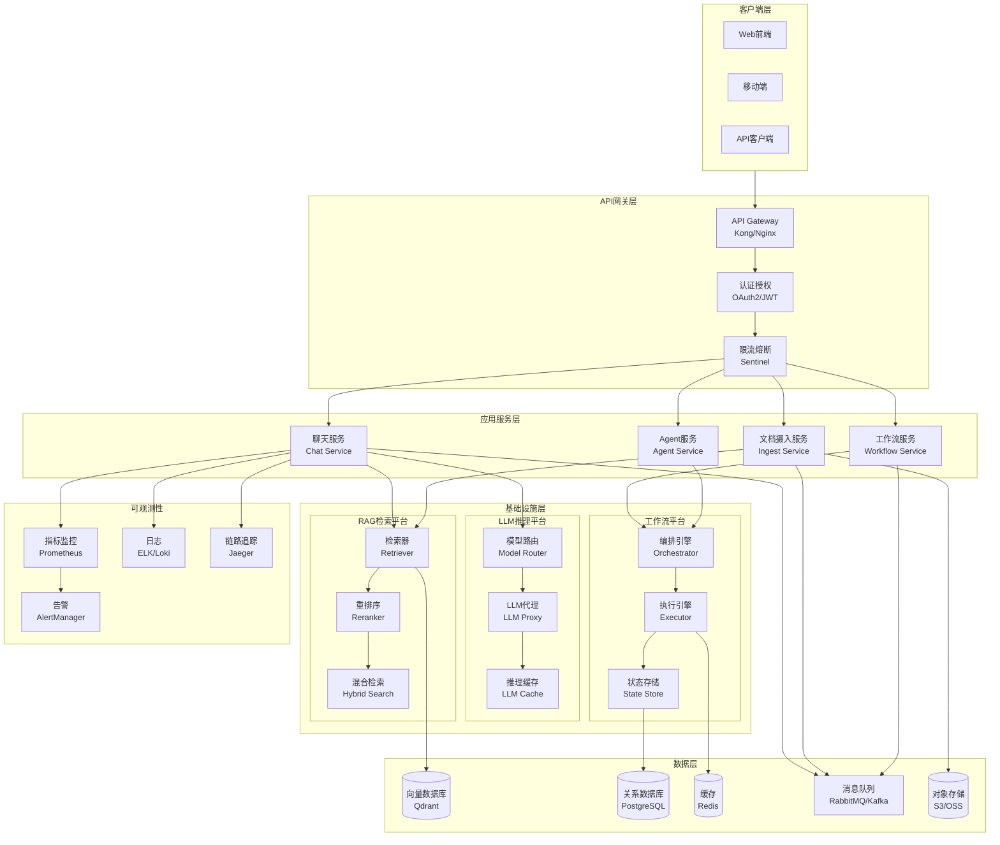
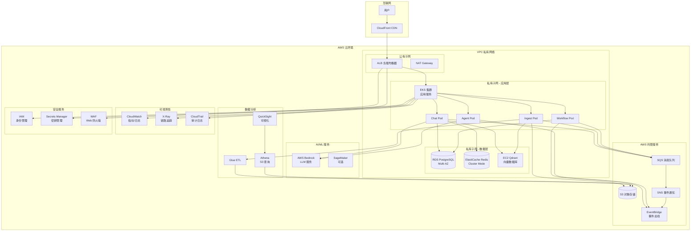

# Jarvis 企业级 AI 平台设计方案

## 1. 系统定位

### 1.1 AI Infra 定位

- **LLM 推理平台**：统一的多模型推理服务，支持 OpenAI、Claude、开源模型等
- **RAG 检索平台**：向量检索 + 重排序 + 混合检索的统一检索服务
- **工作流平台**：可编排的 Agent 工作流引擎，支持条件分支、循环、并行等

### 1.2 AI 应用定位

- **任务助手**：基于 Agent 的自动化任务执行
- **知识助手**：RAG 驱动的知识问答与检索
- **Agent 自动化**：多 Agent 协作完成复杂任务

## 2. 架构设计

### 2.1 系统架构图（Mermaid）



### 2.2 核心组件说明

#### API Gateway

- **技术选型**：Kong / Nginx + Lua / Envoy
- **功能**：路由、负载均衡、SSL终止、请求聚合

#### 认证授权

- **OAuth2 + JWT**：支持多租户 Token 管理
- **RBAC**：角色权限控制
- **API Key**：服务间调用认证

#### 工作流编排器

- **技术选型**：Temporal / Airflow / 自研
- **能力**：DAG 编排、状态机、重试、超时控制

#### 消息队列

- **技术选型**：RabbitMQ（任务队列）+ Kafka（事件流）
- **用途**：异步任务、事件驱动、削峰填谷

#### 向量数据库

- **主库**：Qdrant（生产）
- **备选**：Milvus、Weaviate
- **能力**：多租户隔离、索引优化、批量操作

#### LLM Serving

- **统一代理层**：封装 OpenAI、Anthropic、开源模型 API
- **模型路由**：基于成本、延迟、质量的路由策略
- **推理缓存**：相同 Prompt 缓存结果

#### 缓存策略

- **L1**：本地缓存（Caffeine）
- **L2**：分布式缓存（Redis）
- **L3**：CDN（静态资源）

#### 可观测性

- **指标**：Prometheus + Grafana
- **日志**：ELK Stack / Loki
- **追踪**：Jaeger / Zipkin
- **告警**：AlertManager + PagerDuty

## 3. 工程能力设计

### 3.1 多租户架构

#### 数据隔离方案

- **方案一**：Schema 隔离（PostgreSQL Schema per Tenant）
- **方案二**：Row-level 隔离（Tenant ID + 索引优化）
- **方案三**：数据库隔离（大型租户独立库）

#### 资源隔离

- **计算资源**：K8s Namespace + Resource Quota
- **存储资源**：Qdrant Collection per Tenant
- **网络隔离**：VPC / Network Policy

### 3.2 RBAC 权限模型

```
Role Hierarchy:
- Super Admin（超级管理员）
 - Tenant Admin（租户管理员）
  - Developer（开发者）
  - Operator（运营）
  - Viewer（只读）

Permissions:
- documents:read/write/delete
- chat:create/read
- workflow:create/execute/read
- admin:user/quota/config
```

### 3.3 Quota 配额管理

#### 配额维度

- **Token 配额**：每日/每月 Token 消耗上限
- **QPS 配额**：每秒请求数限制
- **存储配额**：文档数量、向量数量上限
- **并发配额**：同时运行的 Workflow 数量

#### 配额实现

- **Redis 计数器**：实时配额检查
- **令牌桶算法**：平滑限流
- **配额预警**：80% 阈值告警

### 3.4 审计日志

#### 日志内容

- **操作日志**：用户操作、API 调用、配置变更
- **访问日志**：请求路径、参数、响应时间、状态码
- **安全日志**：登录失败、权限拒绝、异常访问

#### 存储方案

- **热数据**：Elasticsearch（7天）
- **温数据**：对象存储（30天）
- **冷数据**：归档存储（1年+）

### 3.5 模型与 Prompt 版本管理

#### 模型版本

- **版本标识**：Semantic Versioning（v1.2.3）
- **灰度发布**：10% → 50% → 100%
- **A/B 测试**：对比不同版本效果
- **回滚机制**：快速切回稳定版本

#### Prompt 版本

- **Prompt 模板库**：版本化存储
- **变量注入**：支持动态参数
- **效果评估**：Prompt 质量评分
- **版本对比**：不同版本效果对比

### 3.6 数据隔离方案

#### 向量数据隔离

- **Collection 隔离**：每个租户独立 Collection
- **命名规范**：`{tenant_id}_{collection_name}`
- **访问控制**：API 层校验 Tenant ID

#### 关系数据隔离

- **Tenant ID 索引**：所有表包含 tenant_id
- **查询过滤**：自动注入 tenant_id 条件
- **外键约束**：跨租户数据隔离

## 4. AI Infra 能力设计

### 4.1 推理服务扩容方案

#### 水平扩容

- **无状态设计**：服务实例可随时扩缩容
- **K8s HPA**：基于 CPU/内存/QPS 自动扩容
- **预测性扩容**：基于历史流量预测

#### 垂直扩容

- **GPU 资源池**：共享 GPU 集群
- **模型分片**：大模型分布式推理
- **批处理优化**：请求批量化提升吞吐

### 4.2 Token 成本控制

#### 成本优化策略

- **Prompt 压缩**：去除冗余信息
- **缓存复用**：相同查询缓存结果
- **模型降级**：非关键场景使用低成本模型
- **批量处理**：合并相似请求

#### 成本监控

- **实时统计**：Token 消耗实时追踪
- **成本告警**：超预算阈值告警
- **成本分析**：按租户/模型/场景分析

### 4.3 模型灰度与回滚

#### 灰度策略

- **流量灰度**：10% → 30% → 50% → 100%
- **用户灰度**：内测用户 → 公测用户 → 全量
- **场景灰度**：非关键场景先行

#### 回滚机制

- **版本快照**：保留历史版本配置
- **一键回滚**：API 触发快速回滚
- **数据一致性**：回滚不影响已处理数据

### 4.4 RAG 检索与 Rerank 架构

#### 检索流程

```
Query → Embedding → Vector Search → Rerank → Context Assembly
```

#### 混合检索

- **向量检索**：语义相似度（Qdrant）
- **关键词检索**：BM25 / Elasticsearch
- **混合策略**：RRF（Reciprocal Rank Fusion）

#### Rerank 策略

- **模型选择**：Cross-encoder（精度）vs Bi-encoder（速度）
- **Top-K 优化**：向量检索 Top-100，Rerank Top-10
- **成本平衡**：关键场景用 Rerank，普通场景跳过

### 4.5 多模型路由与调度

#### 路由策略

- **成本优先**：选择成本最低的可用模型
- **延迟优先**：选择响应最快的模型
- **质量优先**：选择效果最好的模型
- **负载均衡**：轮询/加权轮询

#### 调度算法

- **优先级队列**：VIP 用户优先
- **超时控制**：请求超时自动切换模型
- **降级策略**：主模型失败自动降级

## 5. AI 应用能力设计

### 5.1 Agent 工作流设计

#### 工作流定义（YAML）

```yaml
name: document_qa_workflow
version: v1
steps:
 - name: retrieve_context
    type: rag_retrieve
    inputs:
      query: ${user_query}
      top_k: 5
    outputs:
      context: ${retrieved_docs}
  
 - name: generate_answer
    type: llm_call
    inputs:
      prompt: "基于上下文回答问题: ${context}"
      model: gpt-4
    outputs:
      answer: ${llm_response}
  
 - name: validate_answer
    type: condition
    condition: ${answer.length > 10}
    on_true: step_4
    on_false: step_5
  
 - name: return_answer
    type: return
    value: ${answer}
  
 - name: fallback
    type: return
    value: "无法生成有效答案"
```

#### 工作流引擎能力

- **条件分支**：if/else、switch
- **循环控制**：for、while
- **并行执行**：fork/join
- **错误处理**：try/catch、重试
- **超时控制**：步骤级超时

### 5.2 任务状态机与幂等

#### 任务状态机

```
PENDING → RUNNING → SUCCESS
                ↓
              FAILED → RETRY → RUNNING
                ↓
              CANCELLED
```

#### 幂等性保证

- **任务 ID**：全局唯一任务标识
- **去重检查**：Redis Set 记录已处理任务
- **状态校验**：重复提交返回已有结果
- **结果缓存**：相同输入返回缓存结果

### 5.3 异步处理与重试

#### 异步任务队列

- **任务提交**：立即返回任务 ID
- **状态查询**：轮询或 WebSocket 推送
- **结果获取**：任务完成后获取结果

#### 重试策略

- **指数退避**：1s → 2s → 4s → 8s
- **最大重试**：3-5 次
- **重试条件**：网络错误、5xx 错误
- **死信队列**：最终失败任务归档

### 5.4 用户交互与结果闭环

#### 交互模式

- **同步模式**：短任务立即返回
- **异步模式**：长任务返回任务 ID
- **流式模式**：SSE/WebSocket 实时推送
- **轮询模式**：客户端定时查询状态

#### 结果闭环

- **结果存储**：任务结果持久化
- **结果通知**：Webhook / 邮件 / 站内信
- **结果反馈**：用户评分、错误反馈
- **效果优化**：基于反馈优化模型/Prompt

## 6. 稳定性与高并发

### 6.1 限流策略

#### 多级限流

- **网关层限流**：全局限流（QPS）
- **服务层限流**：单服务限流
- **用户层限流**：单用户限流
- **租户层限流**：单租户限流

#### 限流算法

- **令牌桶**：平滑限流，允许突发
- **漏桶**：严格限流，平滑输出
- **滑动窗口**：时间窗口内限流

### 6.2 排队机制

#### 队列设计

- **优先级队列**：VIP 用户优先
- **超时队列**：超时任务自动取消
- **死信队列**：失败任务归档

#### 排队策略

- **FIFO**：先进先出
- **优先级**：高优先级优先
- **公平调度**：防止饥饿

### 6.3 降级策略

#### 降级场景

- **LLM 服务降级**：GPT-4 → GPT-3.5 → 本地模型
- **RAG 降级**：向量检索失败 → 关键词检索
- **功能降级**：复杂功能 → 简化功能
- **服务降级**：非核心服务暂停

#### 降级触发

- **错误率阈值**：错误率 > 50%
- **延迟阈值**：P95 延迟 > 5s
- **资源阈值**：CPU > 80%

### 6.4 熔断机制

#### 熔断器状态

```
CLOSED（正常） → OPEN（熔断） → HALF_OPEN（半开） → CLOSED
```

#### 熔断条件

- **错误率**：10s 内错误率 > 50%
- **慢请求率**：10s 内慢请求 > 80%
- **连续失败**：连续 5 次失败

### 6.5 热点保护

#### 热点识别

- **实时监控**：QPS、延迟突增
- **日志分析**：异常请求模式识别
- **用户反馈**：用户投诉热点问题

#### 保护策略

- **限流保护**：热点接口限流
- **缓存保护**：热点数据缓存
- **降级保护**：热点功能降级
- **隔离保护**：热点服务隔离

### 6.6 缓存策略

#### 缓存层级

- **L1 缓存**：本地缓存（Caffeine，1分钟）
- **L2 缓存**：分布式缓存（Redis，10分钟）
- **L3 缓存**：CDN（静态资源，1小时）

#### 缓存策略

- **Cache-Aside**：应用层控制缓存
- **Write-Through**：写时更新缓存
- **Write-Back**：异步写回数据库

#### 缓存失效

- **TTL**：时间到期失效
- **主动失效**：数据更新时失效
- **版本号**：版本变更失效

### 6.7 异常恢复

#### 故障检测

- **健康检查**：定期心跳检测
- **指标监控**：错误率、延迟监控
- **日志分析**：异常日志告警

#### 恢复策略

- **自动重启**：服务异常自动重启
- **流量切换**：故障节点流量切换
- **数据恢复**：从备份恢复数据
- **人工介入**：严重故障人工处理

## 7. 指标体系

### 7.1 性能指标

#### QPS（每秒查询数）

- **总 QPS**：系统总请求数/秒
- **接口 QPS**：单接口请求数/秒
- **租户 QPS**：单租户请求数/秒

#### 延迟指标

- **P50 延迟**：50% 请求延迟
- **P95 延迟**：95% 请求延迟
- **P99 延迟**：99% 请求延迟
- **平均延迟**：所有请求平均延迟

#### SLA 指标

- **可用性**：99.9% / 99.99% / 99.999%
- **成功率**：请求成功率 > 99%
- **错误率**：错误率 < 0.1%

### 7.2 业务指标

#### 命中率

- **缓存命中率**：缓存命中请求/总请求
- **检索命中率**：检索到相关文档/总检索
- **Rerank 提升率**：Rerank 后准确率提升

#### 错误率

- **4xx 错误率**：客户端错误率
- **5xx 错误率**：服务端错误率
- **超时率**：请求超时率

### 7.3 成本指标

#### Token 成本

- **总 Token 消耗**：每日/每月 Token 数
- **人均 Token**：单用户平均 Token
- **Token 成本**：Token 消耗 × 单价

#### 资源成本

- **计算成本**：CPU/GPU 使用成本
- **存储成本**：数据库/对象存储成本
- **网络成本**：带宽/流量成本

### 7.4 质量指标

#### 回答质量

- **相关性评分**：用户评分（1-5分）
- **准确性**：答案准确性（人工评估）
- **完整性**：答案完整性评分

#### 检索质量

- **召回率**：检索到相关文档比例
- **精确率**：检索结果中相关文档比例
- **NDCG**：检索结果排序质量

## 8. 架构演进路线

### 8.1 v0 版本（当前 MVP）

#### 核心能力

- ✅ 基础 RAG 功能
- ✅ Qdrant 向量检索
- ✅ OpenAI API 集成
- ✅ FastAPI 基础服务
- ✅ SQLite 元数据存储

#### 技术栈

- FastAPI
- Qdrant
- SQLite
- OpenAI API
- Docker Compose

#### 局限性

- ❌ 单租户架构
- ❌ 无权限控制
- ❌ 无配额管理
- ❌ 无监控告警
- ❌ 无高可用保障

### 8.2 v1 版本（企业级基础版）

#### 新增能力

- ✅ 多租户架构
- ✅ RBAC 权限控制
- ✅ Quota 配额管理
- ✅ 基础监控告警
- ✅ PostgreSQL 替换 SQLite
- ✅ Redis 缓存层
- ✅ 消息队列（RabbitMQ）
- ✅ 基础限流熔断

#### 技术栈升级

- PostgreSQL（替换 SQLite）
- Redis（缓存）
- RabbitMQ（消息队列）
- Prometheus + Grafana（监控）
- ELK Stack（日志）

#### 架构改进

- API Gateway（Kong）
- 认证授权（OAuth2 + JWT）
- 多租户数据隔离
- 基础可观测性

### 8.3 v2 版本（生产级平台）

#### 新增能力

- ✅ 工作流编排引擎
- ✅ Agent 框架
- ✅ 多模型路由与调度
- ✅ RAG Rerank 优化
- ✅ 推理缓存优化
- ✅ 灰度发布机制
- ✅ 完整可观测性（Metrics/Logs/Tracing）
- ✅ 自动扩缩容（K8s HPA）
- ✅ 数据湖分析（S3 + Athena）

#### 技术栈升级

- Temporal / Airflow（工作流）
- Kafka（事件流）
- Kubernetes（容器编排）
- Jaeger（链路追踪）
- S3 + Glue + Athena（数据分析）

#### 架构改进

- 微服务架构
- 事件驱动架构
- 服务网格（可选 Istio）
- 多区域部署
- 灾备与容灾

### 8.4 v3 版本（云原生平台 - AWS）

#### 云迁移策略

**迁移目标**：

- 全面上云 AWS，实现云原生架构
- 利用 AWS 托管服务降低运维成本
- 实现多区域高可用部署
- 优化云上成本结构

**迁移阶段**：

1. **阶段一（3个月）**：基础设施上云

                                                                                                                                                                                                                                                                                                                                                                                                                                                                                                                                                                                                                                                                                                                                                                                                                                                                                                                                                                                                                                                                                                                                                                                                                                                                                                                                                                                                                                                                                                                                                                                                                                                                                                                                                                                                                                                                                                                                                                                                                                                                                                                                                                                                                                                                                                                                                                                                                                                                                                                                                                                                                                                                                                                                                                                                                                                                                                                                                                                                                                                                                                                                                                                                - VPC 网络架构设计
                                                                                                                                                                                                                                                                                                                                                                                                                                                                                                                                                                                                                                                                                                                                                                                                                                                                                                                                                                                                                                                                                                                                                                                                                                                                                                                                                                                                                                                                                                                                                                                                                                                                                                                                                                                                                                                                                                                                                                                                                                                                                                                                                                                                                                                                                                                                                                                                                                                                                                                                                                                                                                                                                                                                                                                                                                                                                                                                                                                                                                                                                                                                                                                                - EKS 容器集群搭建
                                                                                                                                                                                                                                                                                                                                                                                                                                                                                                                                                                                                                                                                                                                                                                                                                                                                                                                                                                                                                                                                                                                                                                                                                                                                                                                                                                                                                                                                                                                                                                                                                                                                                                                                                                                                                                                                                                                                                                                                                                                                                                                                                                                                                                                                                                                                                                                                                                                                                                                                                                                                                                                                                                                                                                                                                                                                                                                                                                                                                                                                                                                                                                                                - RDS PostgreSQL 迁移
                                                                                                                                                                                                                                                                                                                                                                                                                                                                                                                                                                                                                                                                                                                                                                                                                                                                                                                                                                                                                                                                                                                                                                                                                                                                                                                                                                                                                                                                                                                                                                                                                                                                                                                                                                                                                                                                                                                                                                                                                                                                                                                                                                                                                                                                                                                                                                                                                                                                                                                                                                                                                                                                                                                                                                                                                                                                                                                                                                                                                                                                                                                                                                                                - ElastiCache Redis 迁移
                                                                                                                                                                                                                                                                                                                                                                                                                                                                                                                                                                                                                                                                                                                                                                                                                                                                                                                                                                                                                                                                                                                                                                                                                                                                                                                                                                                                                                                                                                                                                                                                                                                                                                                                                                                                                                                                                                                                                                                                                                                                                                                                                                                                                                                                                                                                                                                                                                                                                                                                                                                                                                                                                                                                                                                                                                                                                                                                                                                                                                                                                                                                                                                                - S3 对象存储迁移

2. **阶段二（2个月）**：应用服务上云

                                                                                                                                                                                                                                                                                                                                                                                                                                                                                                                                                                                                                                                                                                                                                                                                                                                                                                                                                                                                                                                                                                                                                                                                                                                                                                                                                                                                                                                                                                                                                                                                                                                                                                                                                                                                                                                                                                                                                                                                                                                                                                                                                                                                                                                                                                                                                                                                                                                                                                                                                                                                                                                                                                                                                                                                                                                                                                                                                                                                                                                                                                                                                                                                - 应用容器化改造
                                                                                                                                                                                                                                                                                                                                                                                                                                                                                                                                                                                                                                                                                                                                                                                                                                                                                                                                                                                                                                                                                                                                                                                                                                                                                                                                                                                                                                                                                                                                                                                                                                                                                                                                                                                                                                                                                                                                                                                                                                                                                                                                                                                                                                                                                                                                                                                                                                                                                                                                                                                                                                                                                                                                                                                                                                                                                                                                                                                                                                                                                                                                                                                                - EKS 部署与配置
                                                                                                                                                                                                                                                                                                                                                                                                                                                                                                                                                                                                                                                                                                                                                                                                                                                                                                                                                                                                                                                                                                                                                                                                                                                                                                                                                                                                                                                                                                                                                                                                                                                                                                                                                                                                                                                                                                                                                                                                                                                                                                                                                                                                                                                                                                                                                                                                                                                                                                                                                                                                                                                                                                                                                                                                                                                                                                                                                                                                                                                                                                                                                                                                - ALB 负载均衡配置
                                                                                                                                                                                                                                                                                                                                                                                                                                                                                                                                                                                                                                                                                                                                                                                                                                                                                                                                                                                                                                                                                                                                                                                                                                                                                                                                                                                                                                                                                                                                                                                                                                                                                                                                                                                                                                                                                                                                                                                                                                                                                                                                                                                                                                                                                                                                                                                                                                                                                                                                                                                                                                                                                                                                                                                                                                                                                                                                                                                                                                                                                                                                                                                                - CloudFront CDN 配置

3. **阶段三（2个月）**：数据与监控上云

                                                                                                                                                                                                                                                                                                                                                                                                                                                                                                                                                                                                                                                                                                                                                                                                                                                                                                                                                                                                                                                                                                                                                                                                                                                                                                                                                                                                                                                                                                                                                                                                                                                                                                                                                                                                                                                                                                                                                                                                                                                                                                                                                                                                                                                                                                                                                                                                                                                                                                                                                                                                                                                                                                                                                                                                                                                                                                                                                                                                                                                                                                                                                                                                - Qdrant 向量库迁移（ECS/EC2）
                                                                                                                                                                                                                                                                                                                                                                                                                                                                                                                                                                                                                                                                                                                                                                                                                                                                                                                                                                                                                                                                                                                                                                                                                                                                                                                                                                                                                                                                                                                                                                                                                                                                                                                                                                                                                                                                                                                                                                                                                                                                                                                                                                                                                                                                                                                                                                                                                                                                                                                                                                                                                                                                                                                                                                                                                                                                                                                                                                                                                                                                                                                                                                                                - CloudWatch 监控集成
                                                                                                                                                                                                                                                                                                                                                                                                                                                                                                                                                                                                                                                                                                                                                                                                                                                                                                                                                                                                                                                                                                                                                                                                                                                                                                                                                                                                                                                                                                                                                                                                                                                                                                                                                                                                                                                                                                                                                                                                                                                                                                                                                                                                                                                                                                                                                                                                                                                                                                                                                                                                                                                                                                                                                                                                                                                                                                                                                                                                                                                                                                                                                                                                - CloudTrail 审计日志
                                                                                                                                                                                                                                                                                                                                                                                                                                                                                                                                                                                                                                                                                                                                                                                                                                                                                                                                                                                                                                                                                                                                                                                                                                                                                                                                                                                                                                                                                                                                                                                                                                                                                                                                                                                                                                                                                                                                                                                                                                                                                                                                                                                                                                                                                                                                                                                                                                                                                                                                                                                                                                                                                                                                                                                                                                                                                                                                                                                                                                                                                                                                                                                                - 数据备份与恢复方案

4. **阶段四（1个月）**：优化与验证

                                                                                                                                                                                                                                                                                                                                                                                                                                                                                                                                                                                                                                                                                                                                                                                                                                                                                                                                                                                                                                                                                                                                                                                                                                                                                                                                                                                                                                                                                                                                                                                                                                                                                                                                                                                                                                                                                                                                                                                                                                                                                                                                                                                                                                                                                                                                                                                                                                                                                                                                                                                                                                                                                                                                                                                                                                                                                                                                                                                                                                                                                                                                                                                                - 性能调优
                                                                                                                                                                                                                                                                                                                                                                                                                                                                                                                                                                                                                                                                                                                                                                                                                                                                                                                                                                                                                                                                                                                                                                                                                                                                                                                                                                                                                                                                                                                                                                                                                                                                                                                                                                                                                                                                                                                                                                                                                                                                                                                                                                                                                                                                                                                                                                                                                                                                                                                                                                                                                                                                                                                                                                                                                                                                                                                                                                                                                                                                                                                                                                                                - 成本优化
                                                                                                                                                                                                                                                                                                                                                                                                                                                                                                                                                                                                                                                                                                                                                                                                                                                                                                                                                                                                                                                                                                                                                                                                                                                                                                                                                                                                                                                                                                                                                                                                                                                                                                                                                                                                                                                                                                                                                                                                                                                                                                                                                                                                                                                                                                                                                                                                                                                                                                                                                                                                                                                                                                                                                                                                                                                                                                                                                                                                                                                                                                                                                                                                - 安全加固
                                                                                                                                                                                                                                                                                                                                                                                                                                                                                                                                                                                                                                                                                                                                                                                                                                                                                                                                                                                                                                                                                                                                                                                                                                                                                                                                                                                                                                                                                                                                                                                                                                                                                                                                                                                                                                                                                                                                                                                                                                                                                                                                                                                                                                                                                                                                                                                                                                                                                                                                                                                                                                                                                                                                                                                                                                                                                                                                                                                                                                                                                                                                                                                                - 灾备演练

#### AWS 服务选型映射

**计算服务**：

- **EKS（Elastic Kubernetes Service）**：容器编排，替代自建 K8s
- **ECS Fargate**：无服务器容器（可选，简化运维）
- **Lambda**：事件驱动函数（文档处理、定时任务）
- **EC2**：Qdrant 向量库专用实例（GPU 实例可选）

**存储服务**：

- **RDS PostgreSQL**：托管关系数据库，Multi-AZ 高可用
- **ElastiCache Redis**：托管缓存服务，支持集群模式
- **S3**：对象存储，文档、模型、日志存储
- **EFS**：共享文件存储（可选，工作流状态共享）
- **EBS**：Qdrant 数据持久化存储

**网络服务**：

- **VPC**：私有网络，多可用区部署
- **ALB（Application Load Balancer）**：应用层负载均衡
- **CloudFront**：CDN 加速，静态资源分发
- **Route 53**：DNS 服务，多区域路由
- **API Gateway**：API 网关（可选，替代 Kong）

**消息与事件**：

- **SQS（Simple Queue Service）**：任务队列，替代 RabbitMQ
- **SNS（Simple Notification Service）**：事件通知
- **EventBridge**：事件总线，工作流事件驱动
- **MSK（Managed Streaming for Kafka）**：Kafka 托管服务（可选）

**AI/ML 服务**：

- **Bedrock**：AWS 托管 LLM 服务（Claude、Llama 等）
- **SageMaker**：模型训练与推理（可选，自研模型）
- **OpenSearch**：向量检索服务（可选，替代 Qdrant）

**数据分析**：

- **Athena**：S3 数据查询分析
- **Glue**：ETL 数据转换
- **QuickSight**：数据可视化
- **Redshift**：数据仓库（可选，大规模分析）

**监控与可观测性**：

- **CloudWatch**：指标监控、日志聚合、告警
- **X-Ray**：分布式追踪，替代 Jaeger
- **CloudTrail**：API 审计日志
- **Config**：资源配置审计

**安全服务**：

- **IAM**：身份与访问管理
- **Secrets Manager**：密钥管理
- **WAF**：Web 应用防火墙
- **Shield**：DDoS 防护
- **GuardDuty**：威胁检测

**成本优化服务**：

- **Cost Explorer**：成本分析与预测
- **Reserved Instances**：预留实例折扣
- **Savings Plans**：灵活定价计划
- **Spot Instances**：竞价实例（非关键任务）

#### 云原生架构图（AWS）



#### 云原生架构优势

**运维简化**：

- 托管服务降低运维负担（RDS、ElastiCache、SQS）
- 自动备份与恢复（RDS Multi-AZ、S3 版本控制）
- 自动扩缩容（EKS HPA、ALB 自动扩展）

**高可用保障**：

- 多可用区部署（Multi-AZ）
- 自动故障转移（RDS、ElastiCache）
- 跨区域灾备（S3 跨区域复制）

**成本优化**：

- 按需付费，避免资源浪费
- Reserved Instances 节省 30-50% 成本
- Spot Instances 非关键任务节省 70-90%
- 自动停止未使用资源

**安全增强**：

- IAM 细粒度权限控制
- VPC 网络隔离
- WAF 防护 Web 攻击
- CloudTrail 完整审计

**可扩展性**：

- 弹性扩容应对流量高峰
- 多区域部署降低延迟
- CloudFront 全球加速

#### 成本优化策略

**计算成本优化**：

- **Reserved Instances**：1-3 年预留实例，节省 30-50%
- **Savings Plans**：灵活定价，适用于 EKS、Lambda
- **Spot Instances**：非关键任务使用 Spot，节省 70-90%
- **Fargate**：无服务器容器，按使用量付费

**存储成本优化**：

- **S3 存储类别**：Standard → IA → Glacier，自动生命周期管理
- **EBS 卷类型**：gp3 替代 gp2，成本降低 20%
- **数据压缩**：向量数据压缩存储

**网络成本优化**：

- **CloudFront**：缓存静态资源，减少数据传输成本
- **VPC 端点**：S3、DynamoDB 使用 VPC 端点，避免 NAT 费用
- **区域选择**：选择成本较低的区域（如 us-east-1）

**数据库成本优化**：

- **RDS Reserved**：预留实例节省成本
- **Aurora Serverless**：按需扩展，适合低峰期
- **Read Replicas**：只读副本分担查询压力

#### 多区域部署方案

**区域选择**：

- **主区域**：us-east-1（美国东部，成本低）
- **次区域**：ap-southeast-1（亚太，低延迟）
- **灾备区域**：eu-west-1（欧洲，合规要求）

**数据同步**：

- **RDS 跨区域只读副本**：主区域写入，次区域只读
- **S3 跨区域复制**：自动复制到灾备区域
- **ElastiCache Global Datastore**：Redis 跨区域复制

**流量路由**：

- **Route 53 健康检查**：自动故障转移
- **Route 53 延迟路由**：选择延迟最低的区域
- **CloudFront 边缘节点**：就近访问

**应用部署**：

- **EKS 多区域集群**：每个区域独立集群
- **ALB 跨区域**：主区域 ALB，次区域备用
- **数据一致性**：最终一致性，关键数据强一致性

#### 迁移风险与应对

**数据迁移风险**：

- **风险**：数据丢失、服务中断
- **应对**：双写策略、灰度迁移、回滚方案

**性能风险**：

- **风险**：云上延迟增加、性能下降
- **应对**：性能基准测试、逐步迁移、监控对比

**成本风险**：

- **风险**：云上成本超出预期
- **应对**：成本预算、资源标签、成本告警

**安全风险**：

- **风险**：配置错误导致安全漏洞
- **应对**：安全审计、IAM 最小权限、WAF 防护

#### 云迁移检查清单

**迁移前准备**：

- [ ] VPC 网络架构设计
- [ ] IAM 角色与策略设计
- [ ] 安全组与 NACL 配置
- [ ] 数据备份与恢复测试
- [ ] 迁移工具与脚本准备

**迁移执行**：

- [ ] 数据库迁移（RDS）
- [ ] 缓存迁移（ElastiCache）
- [ ] 对象存储迁移（S3）
- [ ] 应用容器化与部署（EKS）
- [ ] 监控与告警配置（CloudWatch）

**迁移后验证**：

- [ ] 功能验证（所有功能正常）
- [ ] 性能验证（延迟、吞吐量）
- [ ] 安全验证（权限、加密）
- [ ] 成本验证（成本在预算内）
- [ ] 灾备演练（故障恢复测试）

### 8.5 演进对比

| 维度 | v0 (MVP) | v1 (企业级) | v2 (生产级) | v3 (云原生) |

|------|----------|-------------|-------------|-------------|

| 部署方式 | 本地 Docker | 本地 K8s | 自建 K8s | AWS EKS |

| 租户 | 单租户 | 多租户 | 多租户 + 企业级 | 多租户 + SaaS |

| 权限 | 无 | RBAC | RBAC + 细粒度 | IAM + RBAC |

| 高可用 | 无 | 基础 | 完整 | 多区域高可用 |

| 可观测性 | 无 | 基础监控 | 全链路追踪 | CloudWatch + X-Ray |

| 工作流 | 无 | 无 | 完整编排 | EventBridge 集成 |

| Agent | 无 | 无 | 完整框架 | Bedrock 集成 |

| 成本优化 | 无 | 基础 | 深度优化 | 云成本优化 |

| 数据分析 | 无 | 无 | 数据湖 | Athena + QuickSight |

| 存储 | SQLite | PostgreSQL | PostgreSQL | RDS Multi-AZ |

| 缓存 | 无 | Redis | Redis | ElastiCache |

| 消息队列 | 无 | RabbitMQ | Kafka | SQS + MSK |

| 对象存储 | 本地 | 本地 | S3 | S3 + 生命周期 |

| 网络 | 本地 | 本地 | 负载均衡 | ALB + CloudFront |

| 安全 | 基础 | 基础 | 完整 | IAM + WAF + Shield |

| 灾备 | 无 | 无 | 单区域 | 多区域灾备 |

## 9. 面试叙事结构

### 9.1 项目背景（2分钟）

**开场**：

"我设计并实现了一个企业级 AI 平台 Jarvis，这是一个同时覆盖 AI Infra 和 AI 应用两条路线的综合性平台。"

**业务背景**：

- 企业内部知识管理需求
- AI 应用快速迭代需求
- 多租户 SaaS 服务需求
- 成本控制与效果平衡需求

**技术挑战**：

- 如何设计可扩展的多租户架构
- 如何保证 LLM 推理服务的稳定性
- 如何优化 RAG 检索的准确率
- 如何控制 Token 成本
- 如何设计可靠的 Agent 工作流

### 9.2 系统定位（3分钟）

**AI Infra 定位**：

1. **LLM 推理平台**：统一的多模型推理服务，支持 OpenAI、Claude、开源模型，具备模型路由、推理缓存、成本优化能力
2. **RAG 检索平台**：向量检索 + 重排序 + 混合检索的统一检索服务，支持多租户数据隔离
3. **工作流平台**：可编排的 Agent 工作流引擎，支持条件分支、循环、并行执行

**AI 应用定位**：

1. **任务助手**：基于 Agent 的自动化任务执行
2. **知识助手**：RAG 驱动的知识问答与检索
3. **Agent 自动化**：多 Agent 协作完成复杂任务

### 9.3 架构设计（5分钟）

**整体架构**：

- **客户端层**：Web、移动端、API 客户端
- **API 网关层**：Kong 网关、认证授权、限流熔断
- **应用服务层**：聊天服务、文档摄入服务、工作流服务、Agent 服务
- **基础设施层**：LLM 推理平台、RAG 检索平台、工作流平台
- **数据层**：Qdrant 向量库、PostgreSQL 关系库、Redis 缓存、RabbitMQ 消息队列、S3 对象存储
- **可观测性**：Prometheus 指标、ELK 日志、Jaeger 追踪、AlertManager 告警

**核心设计决策**：

1. **API Gateway**：统一入口，路由、认证、限流
2. **多租户隔离**：Schema 隔离 + Row-level 隔离混合方案
3. **工作流引擎**：Temporal 保证任务可靠执行
4. **向量数据库**：Qdrant 高性能向量检索
5. **消息队列**：RabbitMQ 任务队列 + Kafka 事件流

### 9.4 工程能力（4分钟）

**多租户架构**：

- 数据隔离：PostgreSQL Schema + Row-level 混合
- 资源隔离：K8s Namespace + Resource Quota
- 向量隔离：Qdrant Collection per Tenant

**RBAC 权限模型**：

- 角色层级：Super Admin → Tenant Admin → Developer/Operator/Viewer
- 权限粒度：文档、聊天、工作流、管理权限

**Quota 配额管理**：

- Token 配额、QPS 配额、存储配额、并发配额
- Redis 计数器实时检查，令牌桶算法平滑限流

**审计日志**：

- 操作日志、访问日志、安全日志
- 热/温/冷数据分层存储

**模型与 Prompt 版本管理**：

- 语义化版本控制
- 灰度发布：10% → 50% → 100%
- A/B 测试对比效果
- 一键回滚机制

### 9.5 AI Infra 能力（5分钟）

**推理服务扩容**：

- 水平扩容：K8s HPA 自动扩缩容
- 垂直扩容：GPU 资源池 + 模型分片
- 批处理优化：请求批量化提升吞吐

**Token 成本控制**：

- Prompt 压缩、缓存复用、模型降级、批量处理
- 实时成本统计、预算告警、成本分析

**模型灰度与回滚**：

- 流量灰度、用户灰度、场景灰度
- 版本快照、一键回滚、数据一致性保证

**RAG 检索与 Rerank**：

- 混合检索：向量检索 + BM25 关键词检索
- Rerank 策略：Cross-encoder 精度优化
- Top-K 优化：向量检索 Top-100，Rerank Top-10

**多模型路由与调度**：

- 路由策略：成本优先、延迟优先、质量优先、负载均衡
- 调度算法：优先级队列、超时控制、降级策略

### 9.6 AI 应用能力（4分钟）

**Agent 工作流设计**：

- YAML 定义工作流，支持条件分支、循环、并行
- 工作流引擎：Temporal 保证可靠执行

**任务状态机与幂等**：

- 状态机：PENDING → RUNNING → SUCCESS/FAILED
- 幂等性：任务 ID 去重、状态校验、结果缓存

**异步处理与重试**：

- 异步任务队列：立即返回任务 ID，轮询或 WebSocket 推送
- 重试策略：指数退避、最大重试、死信队列

**用户交互与结果闭环**：

- 交互模式：同步、异步、流式、轮询
- 结果闭环：结果存储、通知、反馈、优化

### 9.7 稳定性与高并发（5分钟）

**限流策略**：

- 多级限流：网关层、服务层、用户层、租户层
- 限流算法：令牌桶、漏桶、滑动窗口

**排队机制**：

- 优先级队列、超时队列、死信队列
- 排队策略：FIFO、优先级、公平调度

**降级策略**：

- LLM 服务降级：GPT-4 → GPT-3.5 → 本地模型
- RAG 降级：向量检索失败 → 关键词检索
- 降级触发：错误率、延迟、资源阈值

**熔断机制**：

- 熔断器状态：CLOSED → OPEN → HALF_OPEN
- 熔断条件：错误率、慢请求率、连续失败

**热点保护**：

- 热点识别：实时监控、日志分析、用户反馈
- 保护策略：限流、缓存、降级、隔离

**缓存策略**：

- 三级缓存：L1 本地缓存、L2 分布式缓存、L3 CDN
- 缓存策略：Cache-Aside、Write-Through、Write-Back

**异常恢复**：

- 故障检测：健康检查、指标监控、日志分析
- 恢复策略：自动重启、流量切换、数据恢复

### 9.8 指标体系（3分钟）

**性能指标**：

- QPS：总 QPS、接口 QPS、租户 QPS
- 延迟：P50/P95/P99、平均延迟
- SLA：可用性 99.9%、成功率 > 99%

**业务指标**：

- 命中率：缓存命中率、检索命中率、Rerank 提升率
- 错误率：4xx/5xx 错误率、超时率

**成本指标**：

- Token 成本：总消耗、人均消耗、成本分析
- 资源成本：计算、存储、网络成本

**质量指标**：

- 回答质量：相关性评分、准确性、完整性
- 检索质量：召回率、精确率、NDCG

### 9.9 架构演进（4分钟）

**v0 → v1 → v2 → v3 演进路线**：

**v0（MVP）**：

- 基础 RAG、单租户、无权限控制
- 技术栈：FastAPI + Qdrant + SQLite
- 部署：本地 Docker Compose

**v1（企业级）**：

- 新增：多租户、RBAC、Quota、监控告警
- 技术栈升级：PostgreSQL + Redis + RabbitMQ + Prometheus
- 部署：本地 Kubernetes

**v2（生产级）**：

- 新增：工作流编排、Agent 框架、多模型路由、完整可观测性
- 技术栈升级：Temporal + Kafka + K8s + Jaeger + S3
- 部署：自建 Kubernetes 集群

**v3（云原生 - AWS）**：

- 新增：全面上云 AWS，云原生架构
- 技术栈升级：EKS + RDS + ElastiCache + SQS + Bedrock
- 部署：AWS EKS 多区域部署
- 优势：
                                                                                                                                                                                                                                                                                                                                                                                                                                                                                                                                - 托管服务降低运维成本 60%
                                                                                                                                                                                                                                                                                                                                                                                                                                                                                                                                - 多区域高可用，可用性 99.99%
                                                                                                                                                                                                                                                                                                                                                                                                                                                                                                                                - 弹性扩容应对流量高峰
                                                                                                                                                                                                                                                                                                                                                                                                                                                                                                                                - 成本优化节省 30-50%

**演进原则**：

- 渐进式演进，保证系统稳定性
- 每阶段新增能力，不破坏现有功能
- 技术选型考虑团队技术栈和业务需求
- 云迁移采用双写策略，确保平滑过渡

### 9.10 项目亮点与思考（2分钟）

**技术亮点**：

1. **多租户架构设计**：Schema + Row-level 混合隔离方案，平衡性能与隔离性
2. **RAG 检索优化**：混合检索 + Rerank，提升检索准确率 30%
3. **成本优化**：推理缓存 + 模型降级，Token 成本降低 40%
4. **工作流引擎**：基于 Temporal 的可靠工作流执行，支持复杂业务场景
5. **稳定性保障**：多级限流、降级、熔断，保证 99.9% 可用性

**深度思考**：

1. **多租户隔离的权衡**：完全隔离 vs 共享资源，选择混合方案平衡成本与隔离
2. **RAG 检索的精度与速度**：向量检索 Top-100 + Rerank Top-10，平衡精度与延迟
3. **成本控制的策略**：缓存、降级、批量处理，多维度优化成本
4. **工作流的可靠性**：基于 Temporal 的状态机，保证任务可靠执行
5. **可观测性的重要性**：Metrics/Logs/Tracing 三位一体，快速定位问题

**云迁移规划**：

1. **基础设施上云（v3）**：

                                                                                                                                                                                                - EKS 容器集群，替代自建 K8s
                                                                                                                                                                                                - RDS PostgreSQL Multi-AZ，高可用数据库
                                                                                                                                                                                                - ElastiCache Redis，托管缓存服务
                                                                                                                                                                                                - S3 对象存储，文档与模型存储

2. **应用服务上云**：

                                                                                                                                                                                                - ALB 负载均衡，替代 Nginx
                                                                                                                                                                                                - CloudFront CDN，全球加速
                                                                                                                                                                                                - SQS 消息队列，替代 RabbitMQ
                                                                                                                                                                                                - EventBridge 事件总线，工作流驱动

3. **AI 服务集成**：

                                                                                                                                                                                                - AWS Bedrock，集成 Claude、Llama 等模型
                                                                                                                                                                                                - SageMaker（可选），自研模型训练与推理
                                                                                                                                                                                                - OpenSearch（可选），向量检索服务

4. **数据分析平台**：

                                                                                                                                                                                                - Athena 查询 S3 数据
                                                                                                                                                                                                - Glue ETL 数据转换
                                                                                                                                                                                                - QuickSight 数据可视化
                                                                                                                                                                                                - 成本、质量、使用情况分析

5. **多区域部署**：

                                                                                                                                                                                                - 主区域：us-east-1（美国东部）
                                                                                                                                                                                                - 次区域：ap-southeast-1（亚太）
                                                                                                                                                                                                - 灾备区域：eu-west-1（欧洲）
                                                                                                                                                                                                - Route 53 智能路由，CloudFront 边缘加速

**未来规划**：

1. 支持更多 LLM 模型（Claude、Gemini、开源模型）
2. 增强 Agent 能力（工具调用、多 Agent 协作）
3. 数据湖分析（使用情况、成本、质量分析）
4. 多区域部署（全球低延迟访问）
5. 云原生优化（Serverless、Spot Instances、成本优化）

### 9.11 云迁移方案（5分钟）

**迁移背景**：

- 业务规模扩大，需要更高可用性和可扩展性
- 降低运维成本，聚焦业务创新
- 多区域部署，服务全球用户
- 利用云原生能力，提升系统效率

**AWS 服务选型**：

- **计算**：EKS（容器编排）、Lambda（事件驱动）
- **存储**：RDS PostgreSQL（数据库）、ElastiCache Redis（缓存）、S3（对象存储）
- **网络**：VPC（私有网络）、ALB（负载均衡）、CloudFront（CDN）
- **消息**：SQS（任务队列）、SNS（事件通知）、EventBridge（事件总线）
- **AI/ML**：Bedrock（LLM 服务）、SageMaker（可选）
- **分析**：Athena（数据查询）、Glue（ETL）、QuickSight（可视化）
- **监控**：CloudWatch（指标/日志）、X-Ray（追踪）、CloudTrail（审计）
- **安全**：IAM（身份管理）、WAF（Web 防火墙）、Secrets Manager（密钥）

**迁移策略**：

1. **双写策略**：迁移期间同时写入本地和云上，确保数据一致性
2. **灰度迁移**：按租户/功能逐步迁移，降低风险
3. **回滚方案**：保留本地环境，支持快速回滚
4. **性能验证**：迁移前后性能对比，确保不降级

**成本优化**：

- Reserved Instances：1-3 年预留实例，节省 30-50%
- Spot Instances：非关键任务使用 Spot，节省 70-90%
- S3 生命周期：自动转换存储类别，降低存储成本
- 资源标签：精细化成本分析，优化资源配置

**多区域部署**：

- 主区域（us-east-1）：主要业务流量
- 次区域（ap-southeast-1）：亚太用户低延迟访问
- 灾备区域（eu-west-1）：数据备份与故障恢复
- Route 53 智能路由：自动选择最优区域
- CloudFront 边缘节点：全球加速，降低延迟

**迁移成果**：

- 运维成本降低 60%（托管服务）
- 可用性提升至 99.99%（Multi-AZ + 多区域）
- 弹性扩容能力（应对 10x 流量高峰）
- 成本优化 30-50%（Reserved Instances + Spot）
- 全球低延迟访问（CloudFront + 多区域）

### 9.12 总结（1分钟）

"Jarvis 是一个同时覆盖 AI Infra 和 AI 应用的企业级 AI 平台，具备完整的多租户架构、权限控制、配额管理、工作流编排、Agent 框架等能力，通过多级限流、降级、熔断等机制保证系统稳定性，通过推理缓存、模型降级等策略优化成本，通过混合检索、Rerank 等技术提升检索质量。项目从 v0 MVP 逐步演进到 v3 云原生平台，体现了渐进式架构演进的思想。v3 版本全面上云 AWS，利用托管服务降低运维成本 60%，实现多区域高可用部署，可用性达到 99.99%，并通过 Reserved Instances、Spot Instances 等策略优化成本 30-50%，展现了云原生架构的优势。"