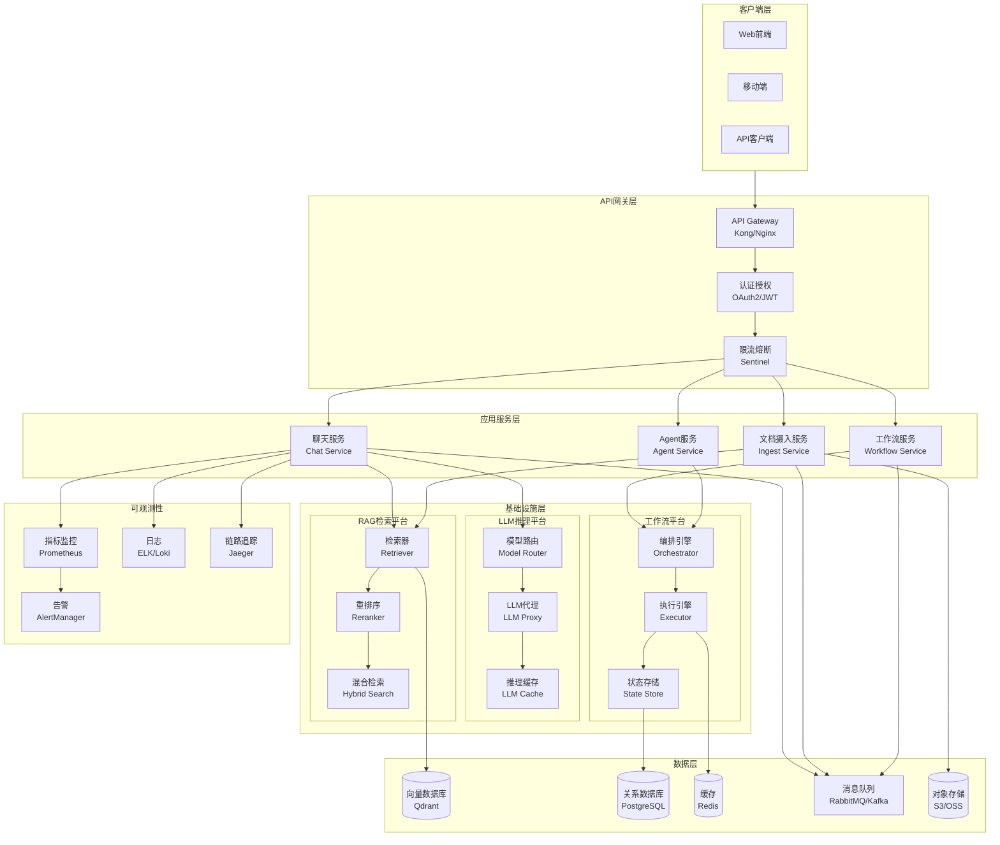
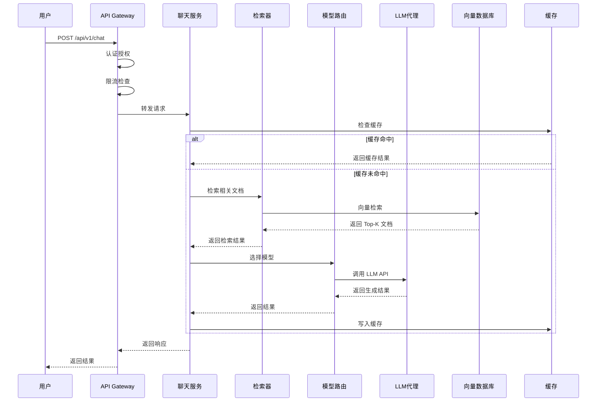
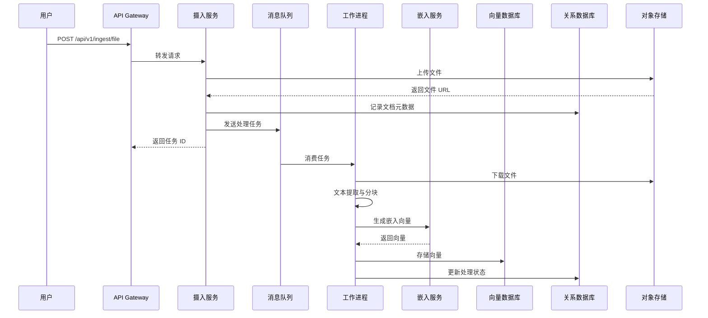
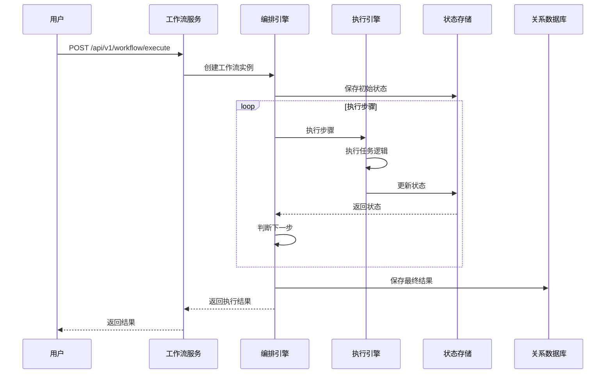
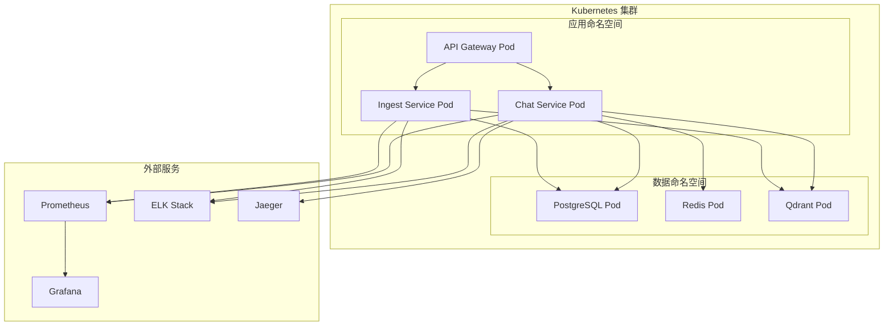

# Jarvis 企业级 AI 平台 - 系统架构设计文档

## 1. 概述

### 1.1 文档目的

本文档描述 Jarvis 企业级 AI 平台的系统架构设计，包括整体架构、核心组件、技术选型、数据流设计等内容，为系统实施提供架构指导。

### 1.2 系统定位

Jarvis 是一个同时覆盖 **AI Infra** 和 **AI 应用** 两条路线的企业级 AI 平台：

**AI Infra 定位**：
- **LLM 推理平台**：统一的多模型推理服务，支持 OpenAI、Claude、开源模型等
- **RAG 检索平台**：向量检索 + 重排序 + 混合检索的统一检索服务
- **工作流平台**：可编排的 Agent 工作流引擎，支持条件分支、循环、并行等

**AI 应用定位**：
- **任务助手**：基于 Agent 的自动化任务执行
- **知识助手**：RAG 驱动的知识问答与检索
- **Agent 自动化**：多 Agent 协作完成复杂任务

### 1.3 设计原则

1. **可扩展性**：支持水平扩展，应对业务增长
2. **高可用性**：多级容错，保证 99.9%+ 可用性
3. **安全性**：多租户隔离，细粒度权限控制
4. **可观测性**：完整的监控、日志、追踪体系
5. **成本优化**：智能路由、缓存、降级策略

---

## 2. 整体架构

### 2.1 系统架构图



### 2.2 架构分层说明

#### 2.2.1 客户端层
- **Web 前端**：React/Vue 单页应用
- **移动端**：iOS/Android 原生应用
- **API 客户端**：第三方系统集成

#### 2.2.2 API 网关层
- **统一入口**：所有外部请求统一接入
- **路由转发**：根据路径转发到对应服务
- **认证授权**：OAuth2/JWT Token 验证
- **限流熔断**：保护后端服务

#### 2.2.3 应用服务层
- **聊天服务**：处理用户问答请求
- **文档摄入服务**：处理文档上传与向量化
- **工作流服务**：管理工作流定义与执行
- **Agent 服务**：Agent 任务调度与执行

#### 2.2.4 基础设施层
- **LLM 推理平台**：统一的多模型推理服务
- **RAG 检索平台**：向量检索与重排序
- **工作流平台**：工作流编排与执行引擎

#### 2.2.5 数据层
- **向量数据库**：Qdrant，存储文档嵌入向量
- **关系数据库**：PostgreSQL，存储元数据
- **缓存**：Redis，热点数据缓存
- **消息队列**：RabbitMQ/Kafka，异步任务处理
- **对象存储**：S3/OSS，文档与模型存储

#### 2.2.6 可观测性
- **指标监控**：Prometheus + Grafana
- **日志聚合**：ELK Stack / Loki
- **链路追踪**：Jaeger / Zipkin
- **告警通知**：AlertManager + PagerDuty

---

## 3. 核心组件设计

### 3.1 API Gateway

#### 3.1.1 技术选型对比

| 方案 | 优势 | 劣势 | 适用场景 |
|------|------|------|----------|
| **Kong** | 插件丰富、云原生、支持 Lua 扩展 | 资源消耗较高 | 企业级生产环境 |
| **Nginx + Lua** | 性能高、轻量级、灵活 | 需要自行开发插件 | 中小型项目 |
| **Envoy** | 云原生、服务网格集成 | 配置复杂 | Kubernetes 环境 |

**选型决策**：选择 **Kong**，原因：
- 插件生态丰富（认证、限流、日志等）
- 云原生设计，易于 Kubernetes 部署
- 支持多租户配置
- 社区活跃，文档完善

#### 3.1.2 核心功能

1. **路由转发**
   - 基于路径的路由规则
   - 支持权重路由（灰度发布）
   - 支持正则表达式匹配

2. **负载均衡**
   - 轮询（Round Robin）
   - 加权轮询（Weighted Round Robin）
   - 最少连接（Least Connections）
   - IP Hash

3. **SSL 终止**
   - TLS/SSL 证书管理
   - 自动证书续期（Let's Encrypt）
   - SNI 支持

4. **请求聚合**
   - GraphQL 查询聚合
   - 批量 API 调用
   - 请求去重

### 3.2 认证授权

#### 3.2.1 OAuth2 + JWT

**OAuth2 流程**：
```
1. 用户登录 → 认证服务器
2. 认证服务器返回 Access Token + Refresh Token
3. 客户端使用 Access Token 访问 API
4. Token 过期后使用 Refresh Token 刷新
```

**JWT Token 结构**：
```json
{
  "header": {
    "alg": "RS256",
    "typ": "JWT"
  },
  "payload": {
    "sub": "user_id",
    "tenant_id": "tenant_123",
    "roles": ["developer"],
    "exp": 1234567890,
    "iat": 1234567890
  },
  "signature": "..."
}
```

#### 3.2.2 RBAC 权限控制

**角色层级**：
```
Super Admin（超级管理员）
  └── Tenant Admin（租户管理员）
      ├── Developer（开发者）
      ├── Operator（运营）
      └── Viewer（只读）
```

**权限矩阵**：

| 角色 | documents | chat | workflow | admin |
|------|-----------|------|----------|-------|
| Super Admin | R/W/D | R/W | R/W/E | All |
| Tenant Admin | R/W/D | R/W | R/W/E | Tenant |
| Developer | R/W | R/W | R/W/E | None |
| Operator | R | R/W | R | None |
| Viewer | R | R | R | None |

#### 3.2.3 API Key 管理

**服务间调用认证**：
- 每个服务分配独立的 API Key
- API Key 存储在 Secrets Manager
- 支持 API Key 轮换
- 记录 API Key 使用日志

### 3.3 工作流编排器

#### 3.3.1 技术选型对比

| 方案 | 优势 | 劣势 | 适用场景 |
|------|------|------|----------|
| **Temporal** | 可靠执行、状态持久化、重试机制 | 学习曲线陡峭 | 复杂工作流 |
| **Airflow** | 成熟稳定、可视化界面 | 不适合短任务 | 数据管道 |
| **自研** | 完全可控、定制化 | 开发成本高 | 特殊需求 |

**选型决策**：选择 **Temporal**，原因：
- 保证工作流可靠执行（即使服务重启）
- 内置重试、超时、版本管理
- 支持复杂的状态机
- 云原生设计，易于扩展

#### 3.3.2 核心能力

1. **DAG 编排**
   - 支持有向无环图
   - 条件分支（if/else）
   - 循环控制（for/while）
   - 并行执行（fork/join）

2. **状态机**
   - 状态持久化
   - 状态查询 API
   - 状态恢复机制

3. **重试机制**
   - 指数退避重试
   - 最大重试次数
   - 重试条件配置

4. **超时控制**
   - 工作流级超时
   - 步骤级超时
   - 超时回调处理

### 3.4 消息队列

#### 3.4.1 技术选型

**RabbitMQ（任务队列）**：
- 用途：异步任务处理、文档摄入、工作流执行
- 特性：可靠消息传递、优先级队列、延迟队列
- 优势：成熟稳定、易于运维

**Kafka（事件流）**：
- 用途：事件驱动、日志收集、数据流处理
- 特性：高吞吐、持久化、流式处理
- 优势：适合大数据场景

#### 3.4.2 队列设计

**任务队列（RabbitMQ）**：
- `chat.queue`：聊天任务队列
- `ingest.queue`：文档摄入队列
- `workflow.queue`：工作流执行队列
- `dlq`：死信队列

**事件流（Kafka）**：
- `user.events`：用户行为事件
- `system.events`：系统事件
- `audit.events`：审计事件

### 3.5 向量数据库

#### 3.5.1 技术选型对比

| 方案 | 优势 | 劣势 | 适用场景 |
|------|------|------|----------|
| **Qdrant** | 性能高、REST API、易部署 | 社区相对小 | 生产环境 |
| **Milvus** | 功能丰富、生态完善 | 部署复杂 | 大规模场景 |
| **Weaviate** | GraphQL API、向量+图 | 资源消耗高 | 复杂查询 |

**选型决策**：选择 **Qdrant**，原因：
- 性能优异（Rust 实现）
- REST API 易于集成
- 支持多租户隔离（Collection 级别）
- 部署简单（Docker/K8s）

#### 3.5.2 多租户隔离

**Collection 隔离**：
- 每个租户独立 Collection
- 命名规范：`{tenant_id}_{collection_name}`
- 访问控制：API 层校验 Tenant ID

**索引优化**：
- HNSW 索引（高性能）
- 向量维度：1536（text-embedding-ada-002）
- 距离度量：余弦相似度

### 3.6 LLM Serving

#### 3.6.1 统一代理层

**支持的模型**：
- OpenAI：GPT-4、GPT-3.5-turbo、text-embedding-ada-002
- Anthropic：Claude 3（Opus、Sonnet、Haiku）
- 开源模型：Llama 2、Mistral、Qwen（通过 Ollama）

**统一接口**：
```python
class LLMProxy:
    def generate(self, prompt: str, model: str = None) -> str:
        """统一生成接口"""
        pass
    
    def embed(self, text: str, model: str = None) -> List[float]:
        """统一嵌入接口"""
        pass
```

#### 3.6.2 模型路由策略

**路由策略**：
1. **成本优先**：选择成本最低的可用模型
2. **延迟优先**：选择响应最快的模型
3. **质量优先**：选择效果最好的模型
4. **负载均衡**：轮询/加权轮询

**路由决策树**：
```
用户请求
  ├── VIP 用户 → GPT-4（质量优先）
  ├── 普通用户 → GPT-3.5-turbo（成本优先）
  └── 批量任务 → 开源模型（成本优先）
```

#### 3.6.3 推理缓存

**缓存策略**：
- Key：Prompt Hash（MD5）
- Value：LLM 响应结果
- TTL：24 小时
- 存储：Redis

**缓存命中率目标**：30-50%

### 3.7 缓存策略

#### 3.7.1 三级缓存架构

**L1 缓存（本地缓存）**：
- 技术：Caffeine
- 容量：1000 条目
- TTL：1 分钟
- 用途：热点数据快速访问

**L2 缓存（分布式缓存）**：
- 技术：Redis
- 容量：10GB
- TTL：10 分钟
- 用途：跨实例数据共享

**L3 缓存（CDN）**：
- 技术：CloudFront / Cloudflare
- TTL：1 小时
- 用途：静态资源分发

#### 3.7.2 缓存策略选择

**Cache-Aside（旁路缓存）**：
- 应用场景：读多写少
- 流程：读缓存 → 缓存未命中 → 读数据库 → 写缓存

**Write-Through（写透）**：
- 应用场景：写操作频繁
- 流程：写数据库 → 写缓存

**Write-Back（写回）**：
- 应用场景：高写入性能要求
- 流程：写缓存 → 异步写数据库

### 3.8 可观测性

#### 3.8.1 指标监控（Prometheus）

**核心指标**：
- QPS：每秒请求数
- 延迟：P50/P95/P99 延迟
- 错误率：4xx/5xx 错误率
- 资源使用：CPU、内存、磁盘

**自定义指标**：
- Token 消耗：每分钟 Token 数
- 缓存命中率：缓存命中/总请求
- 检索准确率：检索结果相关性评分

#### 3.8.2 日志聚合（ELK Stack）

**日志分类**：
- **应用日志**：INFO、WARN、ERROR
- **访问日志**：请求路径、参数、响应时间
- **审计日志**：用户操作、配置变更

**日志存储**：
- 热数据：Elasticsearch（7天）
- 温数据：S3（30天）
- 冷数据：Glacier（1年+）

#### 3.8.3 链路追踪（Jaeger）

**追踪范围**：
- API Gateway → 应用服务 → 基础设施层 → 数据层
- 跨服务调用追踪
- 异步任务追踪

**追踪指标**：
- 服务调用链
- 调用耗时
- 错误传播路径

---

## 4. 数据流设计

### 4.1 聊天请求流程



### 4.2 文档摄入流程



### 4.3 工作流执行流程



---

## 5. 部署架构

### 5.1 本地部署架构（v1/v2）



### 5.2 云原生部署架构（v3 - AWS）

详见《08-云迁移方案.md》

---

## 6. 技术选型总结

### 6.1 核心技术栈

| 层级 | 技术选型 | 版本 | 说明 |
|------|---------|------|------|
| API 网关 | Kong | 3.x | 云原生 API 网关 |
| 认证授权 | OAuth2 + JWT | - | 标准协议 |
| 应用框架 | FastAPI | 0.100+ | Python Web 框架 |
| 工作流引擎 | Temporal | 1.x | 可靠工作流执行 |
| 消息队列 | RabbitMQ + Kafka | 3.x / 3.x | 任务队列 + 事件流 |
| 向量数据库 | Qdrant | 1.x | 高性能向量检索 |
| 关系数据库 | PostgreSQL | 15+ | 企业级数据库 |
| 缓存 | Redis | 7.x | 分布式缓存 |
| 对象存储 | S3 / OSS | - | 云存储 |
| 监控 | Prometheus + Grafana | 2.x / 10.x | 指标监控 |
| 日志 | ELK Stack | 8.x | 日志聚合 |
| 追踪 | Jaeger | 1.x | 分布式追踪 |

### 6.2 选型原则

1. **成熟稳定**：优先选择经过生产验证的技术
2. **云原生**：支持 Kubernetes 部署
3. **社区活跃**：有活跃的社区支持
4. **性能优先**：在满足功能的前提下选择性能更好的方案
5. **成本考虑**：平衡性能与成本

---

## 7. 非功能性需求

### 7.1 性能要求

- **QPS**：单服务支持 1000+ QPS
- **延迟**：P95 延迟 < 2s，P99 延迟 < 5s
- **吞吐量**：文档摄入支持 100+ 文档/分钟

### 7.2 可用性要求

- **SLA**：99.9% 可用性（月度）
- **RTO**：恢复时间目标 < 30 分钟
- **RPO**：恢复点目标 < 5 分钟

### 7.3 扩展性要求

- **水平扩展**：支持动态扩缩容
- **垂直扩展**：支持资源垂直扩展
- **多租户**：支持 1000+ 租户

### 7.4 安全性要求

- **数据加密**：传输加密（TLS）、存储加密（AES-256）
- **访问控制**：RBAC 权限控制
- **审计日志**：完整的操作审计日志

---

## 8. 风险评估

### 8.1 技术风险

| 风险 | 影响 | 概率 | 应对措施 |
|------|------|------|----------|
| 向量数据库性能瓶颈 | 高 | 中 | 分片、索引优化、缓存 |
| LLM API 限流 | 高 | 中 | 多模型路由、请求队列 |
| 消息队列积压 | 中 | 低 | 监控告警、自动扩容 |

### 8.2 运维风险

| 风险 | 影响 | 概率 | 应对措施 |
|------|------|------|----------|
| 服务故障 | 高 | 低 | 多实例部署、健康检查 |
| 数据丢失 | 高 | 低 | 定期备份、多副本 |
| 性能下降 | 中 | 中 | 监控告警、自动扩容 |

---

## 9. 总结

本文档描述了 Jarvis 企业级 AI 平台的系统架构设计，包括：

1. **整体架构**：六层架构设计（客户端层、API 网关层、应用服务层、基础设施层、数据层、可观测性）
2. **核心组件**：API Gateway、认证授权、工作流编排器、消息队列、向量数据库、LLM Serving、缓存策略、可观测性
3. **数据流设计**：聊天请求流程、文档摄入流程、工作流执行流程
4. **部署架构**：本地部署与云原生部署方案
5. **技术选型**：基于成熟稳定、云原生、性能优先的原则

该架构设计支持系统的可扩展性、高可用性、安全性和可观测性要求，为后续的详细设计和实施提供了基础。

---

## 附录

### A. 参考资料

- [Kong 官方文档](https://docs.konghq.com/)
- [Temporal 官方文档](https://docs.temporal.io/)
- [Qdrant 官方文档](https://qdrant.tech/documentation/)
- [Prometheus 最佳实践](https://prometheus.io/docs/practices/)

### B. 术语表

- **API Gateway**：API 网关，统一入口
- **RBAC**：基于角色的访问控制
- **DAG**：有向无环图
- **HNSW**：分层导航小世界图（向量索引算法）
- **RTO**：恢复时间目标
- **RPO**：恢复点目标
