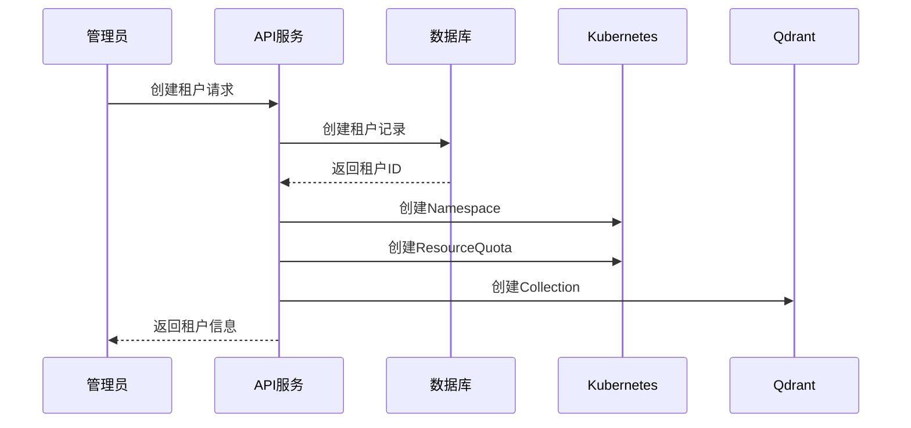
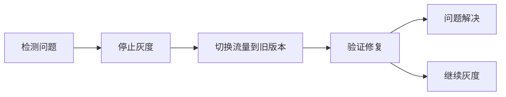

# Jarvis 企业级 AI 平台 - 工程能力设计文档

## 1. 概述

### 1.1 文档目的

本文档描述 Jarvis 企业级 AI 平台的工程能力设计，包括多租户架构、RBAC 权限控制、Quota 配额管理、审计日志、模型版本管理等核心工程能力。

### 1.2 设计目标

1. **多租户隔离**：确保不同租户数据完全隔离，互不影响
2. **权限控制**：细粒度的角色权限管理，支持最小权限原则
3. **资源配额**：防止资源滥用，保证系统稳定性
4. **可审计性**：完整的操作审计日志，满足合规要求
5. **版本管理**：模型和 Prompt 版本化，支持灰度发布

---

## 2. 多租户架构

### 2.1 多租户模型

**租户定义**：
- 租户（Tenant）是资源隔离的基本单位
- 每个租户拥有独立的数据空间和资源配额
- 租户可以是企业客户、部门或项目组

**租户层级**：
```
平台（Platform）
  └── 租户（Tenant）
      └── 用户（User）
          └── 资源（Resource）
```

### 2.2 数据隔离方案

#### 2.2.1 方案对比

| 方案 | 隔离性 | 性能 | 成本 | 适用场景 |
|------|--------|------|------|----------|
| **Schema 隔离** | 高 | 中 | 中 | 中等规模租户 |
| **Row-level 隔离** | 中 | 高 | 低 | 大规模租户 |
| **数据库隔离** | 极高 | 高 | 高 | 大型企业租户 |

#### 2.2.2 混合隔离方案

**选择策略**：
- **小型租户（< 1000 用户）**：Row-level 隔离
- **中型租户（1000-10000 用户）**：Schema 隔离
- **大型租户（> 10000 用户）**：独立数据库

**实现方式**：

**1. Row-level 隔离（PostgreSQL）**

```sql
-- 所有表包含 tenant_id 字段
CREATE TABLE documents (
    id SERIAL PRIMARY KEY,
    tenant_id VARCHAR(50) NOT NULL,
    filename VARCHAR(255),
    content TEXT,
    created_at TIMESTAMP DEFAULT NOW(),
    INDEX idx_tenant_id (tenant_id)
);

-- 查询时自动注入 tenant_id 条件
SELECT * FROM documents 
WHERE tenant_id = ? AND id = ?;
```

**2. Schema 隔离（PostgreSQL）**

```sql
-- 为每个租户创建独立 Schema
CREATE SCHEMA tenant_123;
CREATE TABLE tenant_123.documents (
    id SERIAL PRIMARY KEY,
    filename VARCHAR(255),
    content TEXT,
    created_at TIMESTAMP DEFAULT NOW()
);
```

**3. 数据库隔离**

- 大型租户分配独立 PostgreSQL 实例
- 通过连接池路由到对应数据库
- 支持跨数据库查询（Federated Query）

### 2.3 资源隔离

#### 2.3.1 计算资源隔离

**Kubernetes Namespace**：
```yaml
apiVersion: v1
kind: Namespace
metadata:
  name: tenant-123
---
apiVersion: v1
kind: ResourceQuota
metadata:
  name: tenant-123-quota
  namespace: tenant-123
spec:
  hard:
    requests.cpu: "4"
    requests.memory: 8Gi
    limits.cpu: "8"
    limits.memory: 16Gi
    pods: "10"
```

**资源配额维度**：
- CPU：请求和限制
- 内存：请求和限制
- Pod 数量：最大 Pod 数
- 存储：PVC 大小限制

#### 2.3.2 存储资源隔离

**向量数据库（Qdrant）**：
- 每个租户独立 Collection
- 命名规范：`{tenant_id}_{collection_name}`
- 访问控制：API 层校验 Tenant ID

**关系数据库（PostgreSQL）**：
- Row-level：tenant_id 字段 + 索引
- Schema-level：独立 Schema
- Database-level：独立数据库实例

#### 2.3.3 网络隔离

**VPC 隔离**：
- 每个租户分配独立 VPC（可选）
- 网络策略（Network Policy）限制 Pod 间通信
- 安全组（Security Group）控制网络访问

**实现示例**：
```yaml
apiVersion: networking.k8s.io/v1
kind: NetworkPolicy
metadata:
  name: tenant-123-network-policy
  namespace: tenant-123
spec:
  podSelector: {}
  policyTypes:
  - Ingress
  - Egress
  ingress:
  - from:
    - namespaceSelector:
        matchLabels:
          name: gateway
  egress:
  - to:
    - namespaceSelector:
        matchLabels:
          name: shared-services
```

### 2.4 租户管理

#### 2.4.1 租户创建流程



#### 2.4.2 租户配置

**租户元数据**：
```json
{
  "tenant_id": "tenant_123",
  "name": "Acme Corporation",
  "plan": "enterprise",
  "quota": {
    "token_limit": 1000000,
    "qps_limit": 100,
    "storage_limit": 1000000000,
    "concurrent_workflows": 10
  },
  "created_at": "2024-01-01T00:00:00Z",
  "status": "active"
}
```

---

## 3. RBAC 权限模型

### 3.1 角色定义

#### 3.1.1 角色层级

```
Super Admin（超级管理员）
  └── Tenant Admin（租户管理员）
      ├── Developer（开发者）
      ├── Operator（运营）
      └── Viewer（只读）
```

**角色说明**：

| 角色 | 说明 | 权限范围 |
|------|------|----------|
| **Super Admin** | 平台超级管理员 | 所有租户、所有资源 |
| **Tenant Admin** | 租户管理员 | 本租户所有资源 |
| **Developer** | 开发者 | 本租户开发资源 |
| **Operator** | 运营人员 | 本租户运营资源 |
| **Viewer** | 只读用户 | 本租户只读权限 |

#### 3.1.2 权限矩阵

| 资源 | Super Admin | Tenant Admin | Developer | Operator | Viewer |
|------|-------------|--------------|------------|----------|--------|
| **documents** | R/W/D | R/W/D | R/W | R | R |
| **chat** | R/W | R/W | R/W | R/W | R |
| **workflow** | R/W/E | R/W/E | R/W/E | R | R |
| **agent** | R/W/E | R/W/E | R/W/E | R | R |
| **user** | R/W/D | R/W/D | - | - | - |
| **quota** | R/W | R/W | R | - | - |
| **config** | R/W | R/W | R | - | - |
| **audit** | R | R | - | - | - |

**权限说明**：
- **R**：Read（读取）
- **W**：Write（写入）
- **D**：Delete（删除）
- **E**：Execute（执行）

### 3.2 权限实现

#### 3.2.1 权限模型设计

**数据库设计**：
```sql
-- 角色表
CREATE TABLE roles (
    id SERIAL PRIMARY KEY,
    name VARCHAR(50) NOT NULL UNIQUE,
    description TEXT,
    created_at TIMESTAMP DEFAULT NOW()
);

-- 权限表
CREATE TABLE permissions (
    id SERIAL PRIMARY KEY,
    resource VARCHAR(50) NOT NULL,
    action VARCHAR(50) NOT NULL,
    description TEXT,
    UNIQUE(resource, action)
);

-- 角色权限关联表
CREATE TABLE role_permissions (
    role_id INTEGER REFERENCES roles(id),
    permission_id INTEGER REFERENCES permissions(id),
    PRIMARY KEY (role_id, permission_id)
);

-- 用户角色关联表
CREATE TABLE user_roles (
    user_id INTEGER REFERENCES users(id),
    role_id INTEGER REFERENCES roles(id),
    tenant_id VARCHAR(50),
    PRIMARY KEY (user_id, role_id, tenant_id)
);
```

#### 3.2.2 权限检查

**中间件实现**：
```python
from functools import wraps
from fastapi import HTTPException

def require_permission(resource: str, action: str):
    def decorator(func):
        @wraps(func)
        async def wrapper(*args, **kwargs):
            user = get_current_user()
            tenant_id = get_tenant_id()
            
            if not check_permission(user.id, tenant_id, resource, action):
                raise HTTPException(
                    status_code=403,
                    detail=f"Permission denied: {resource}:{action}"
                )
            
            return await func(*args, **kwargs)
        return wrapper
    return decorator

# 使用示例
@router.post("/documents")
@require_permission("documents", "write")
async def create_document():
    pass
```

### 3.3 权限继承

#### 3.3.1 权限继承规则

```
Super Admin
  └── 继承所有权限
Tenant Admin
  └── 继承 Developer + Operator + Viewer 权限
Developer
  └── 继承 Viewer 权限
Operator
  └── 继承 Viewer 权限
Viewer
  └── 基础只读权限
```

#### 3.3.2 权限计算

**权限计算算法**：
```python
def get_user_permissions(user_id: int, tenant_id: str) -> Set[str]:
    """获取用户所有权限"""
    permissions = set()
    
    # 获取用户角色
    roles = get_user_roles(user_id, tenant_id)
    
    # 获取每个角色的权限
    for role in roles:
        role_perms = get_role_permissions(role.id)
        permissions.update(role_perms)
        
        # 获取继承角色的权限
        parent_roles = get_parent_roles(role.id)
        for parent_role in parent_roles:
            parent_perms = get_role_permissions(parent_role.id)
            permissions.update(parent_perms)
    
    return permissions
```

---

## 4. Quota 配额管理

### 4.1 配额维度

#### 4.1.1 Token 配额

**配额类型**：
- **每日 Token 配额**：每天 Token 消耗上限
- **每月 Token 配额**：每月 Token 消耗上限
- **单次请求 Token 配额**：单次请求最大 Token 数

**配额配置**：
```json
{
  "token_quota": {
    "daily_limit": 1000000,
    "monthly_limit": 30000000,
    "per_request_limit": 10000,
    "warning_threshold": 0.8
  }
}
```

#### 4.1.2 QPS 配额

**配额类型**：
- **总 QPS**：每秒总请求数限制
- **接口 QPS**：单个接口 QPS 限制
- **用户 QPS**：单个用户 QPS 限制

**配额配置**：
```json
{
  "qps_quota": {
    "total_qps": 100,
    "api_qps": {
      "/api/v1/chat": 50,
      "/api/v1/ingest": 20
    },
    "user_qps": 10
  }
}
```

#### 4.1.3 存储配额

**配额类型**：
- **文档数量**：最大文档数
- **向量数量**：最大向量数
- **存储大小**：最大存储空间（GB）

**配额配置**：
```json
{
  "storage_quota": {
    "document_count": 100000,
    "vector_count": 1000000,
    "storage_size_gb": 100
  }
}
```

#### 4.1.4 并发配额

**配额类型**：
- **并发工作流**：同时运行的 Workflow 数量
- **并发 Agent**：同时运行的 Agent 数量

**配额配置**：
```json
{
  "concurrency_quota": {
    "workflow_limit": 10,
    "agent_limit": 5
  }
}
```

### 4.2 配额实现

#### 4.2.1 Redis 计数器

**Token 配额检查**：
```python
import redis
from datetime import datetime, timedelta

redis_client = redis.Redis(host='localhost', port=6379)

def check_token_quota(tenant_id: str, tokens: int) -> bool:
    """检查 Token 配额"""
    today = datetime.now().strftime("%Y-%m-%d")
    key = f"quota:token:{tenant_id}:{today}"
    
    # 获取当前消耗
    current = redis_client.get(key) or 0
    current = int(current)
    
    # 获取配额限制
    quota = get_tenant_quota(tenant_id)["token_quota"]["daily_limit"]
    
    # 检查是否超限
    if current + tokens > quota:
        return False
    
    # 增加消耗
    redis_client.incrby(key, tokens)
    redis_client.expire(key, 86400)  # 24小时过期
    
    return True
```

#### 4.2.2 令牌桶算法

**QPS 限流实现**：
```python
import time
from collections import defaultdict

class TokenBucket:
    def __init__(self, capacity: int, refill_rate: float):
        self.capacity = capacity
        self.refill_rate = refill_rate
        self.tokens = capacity
        self.last_refill = time.time()
    
    def consume(self, tokens: int = 1) -> bool:
        """消费令牌"""
        now = time.time()
        elapsed = now - self.last_refill
        
        # 补充令牌
        self.tokens = min(
            self.capacity,
            self.tokens + elapsed * self.refill_rate
        )
        self.last_refill = now
        
        # 检查是否有足够令牌
        if self.tokens >= tokens:
            self.tokens -= tokens
            return True
        return False

# 使用示例
buckets = defaultdict(lambda: TokenBucket(capacity=100, refill_rate=10))

def check_qps_quota(tenant_id: str) -> bool:
    bucket = buckets[tenant_id]
    return bucket.consume()
```

#### 4.2.3 配额预警

**预警机制**：
```python
def check_quota_warning(tenant_id: str):
    """检查配额预警"""
    quota = get_tenant_quota(tenant_id)
    usage = get_tenant_usage(tenant_id)
    
    # Token 配额预警
    token_usage_rate = usage["token"] / quota["token_quota"]["daily_limit"]
    if token_usage_rate >= 0.8:
        send_warning(
            tenant_id=tenant_id,
            type="token_quota",
            usage_rate=token_usage_rate
        )
    
    # 存储配额预警
    storage_usage_rate = usage["storage"] / quota["storage_quota"]["storage_size_gb"]
    if storage_usage_rate >= 0.8:
        send_warning(
            tenant_id=tenant_id,
            type="storage_quota",
            usage_rate=storage_usage_rate
        )
```

### 4.3 配额管理 API

#### 4.3.1 配额查询

```python
@router.get("/api/v1/tenants/{tenant_id}/quota")
async def get_quota(tenant_id: str):
    """获取租户配额"""
    quota = get_tenant_quota(tenant_id)
    usage = get_tenant_usage(tenant_id)
    
    return {
        "tenant_id": tenant_id,
        "quota": quota,
        "usage": usage,
        "usage_rate": {
            "token": usage["token"] / quota["token_quota"]["daily_limit"],
            "storage": usage["storage"] / quota["storage_quota"]["storage_size_gb"]
        }
    }
```

#### 4.3.2 配额更新

```python
@router.put("/api/v1/tenants/{tenant_id}/quota")
@require_permission("quota", "write")
async def update_quota(tenant_id: str, quota_config: dict):
    """更新租户配额"""
    validate_quota_config(quota_config)
    update_tenant_quota(tenant_id, quota_config)
    
    return {"status": "success"}
```

---

## 5. 审计日志

### 5.1 日志分类

#### 5.1.1 操作日志

**记录内容**：
- 用户操作：创建、更新、删除资源
- API 调用：请求路径、参数、响应状态
- 配置变更：配额修改、权限变更

**日志格式**：
```json
{
  "timestamp": "2024-01-01T10:00:00Z",
  "tenant_id": "tenant_123",
  "user_id": "user_456",
  "action": "create_document",
  "resource_type": "document",
  "resource_id": "doc_789",
  "details": {
    "filename": "example.pdf",
    "size": 1024000
  },
  "ip_address": "192.168.1.1",
  "user_agent": "Mozilla/5.0..."
}
```

#### 5.1.2 访问日志

**记录内容**：
- 请求路径、HTTP 方法
- 请求参数、请求体（脱敏）
- 响应状态码、响应时间
- 错误信息（如有）

**日志格式**：
```json
{
  "timestamp": "2024-01-01T10:00:00Z",
  "tenant_id": "tenant_123",
  "user_id": "user_456",
  "method": "POST",
  "path": "/api/v1/chat",
  "status_code": 200,
  "response_time_ms": 1500,
  "request_size": 1024,
  "response_size": 2048,
  "ip_address": "192.168.1.1"
}
```

#### 5.1.3 安全日志

**记录内容**：
- 登录失败：用户名、IP、失败原因
- 权限拒绝：用户、资源、操作
- 异常访问：可疑 IP、异常行为

**日志格式**：
```json
{
  "timestamp": "2024-01-01T10:00:00Z",
  "event_type": "permission_denied",
  "tenant_id": "tenant_123",
  "user_id": "user_456",
  "resource": "document:doc_789",
  "action": "delete",
  "reason": "insufficient_permissions",
  "ip_address": "192.168.1.1"
}
```

### 5.2 日志存储方案

#### 5.2.1 热数据存储（Elasticsearch）

**存储周期**：7天
**用途**：实时查询、告警

**索引设计**：
```json
{
  "mappings": {
    "properties": {
      "timestamp": {"type": "date"},
      "tenant_id": {"type": "keyword"},
      "user_id": {"type": "keyword"},
      "action": {"type": "keyword"},
      "resource_type": {"type": "keyword"},
      "ip_address": {"type": "ip"}
    }
  }
}
```

#### 5.2.2 温数据存储（S3）

**存储周期**：30天
**用途**：历史查询、分析

**存储格式**：
- 按日期分区：`s3://logs/year=2024/month=01/day=01/`
- 压缩格式：Gzip
- 文件格式：JSON Lines

#### 5.2.3 冷数据存储（Glacier）

**存储周期**：1年+
**用途**：合规要求、长期归档

**存储策略**：
- 自动转换：30天后自动转换到 Glacier
- 检索时间：3-5 小时
- 成本：极低

### 5.3 日志查询接口

#### 5.3.1 操作日志查询

```python
@router.get("/api/v1/audit/operations")
@require_permission("audit", "read")
async def query_operations(
    tenant_id: str,
    start_time: datetime,
    end_time: datetime,
    action: str = None,
    user_id: str = None,
    limit: int = 100
):
    """查询操作日志"""
    query = {
        "bool": {
            "must": [
                {"term": {"tenant_id": tenant_id}},
                {"range": {"timestamp": {"gte": start_time, "lte": end_time}}}
            ]
        }
    }
    
    if action:
        query["bool"]["must"].append({"term": {"action": action}})
    if user_id:
        query["bool"]["must"].append({"term": {"user_id": user_id}})
    
    results = es.search(index="audit-logs", query=query, size=limit)
    return results
```

---

## 6. 模型与 Prompt 版本管理

### 6.1 模型版本管理

#### 6.1.1 版本标识

**语义化版本**：
- 格式：`v{major}.{minor}.{patch}`
- 示例：`v1.2.3`
- Major：不兼容变更
- Minor：新功能，向后兼容
- Patch：Bug 修复

**版本元数据**：
```json
{
  "version": "v1.2.3",
  "model_name": "gpt-4",
  "created_at": "2024-01-01T00:00:00Z",
  "created_by": "user_123",
  "description": "优化了 Prompt 模板",
  "config": {
    "temperature": 0.7,
    "max_tokens": 2000
  },
  "performance": {
    "accuracy": 0.95,
    "latency_p95": 2000
  }
}
```

#### 6.1.2 灰度发布

**灰度策略**：
```
10% 流量 → 30% 流量 → 50% 流量 → 100% 流量
```

**实现方式**：
```python
def select_model_version(tenant_id: str, user_id: str) -> str:
    """选择模型版本"""
    # 获取灰度配置
    rollout_config = get_rollout_config("gpt-4", "v1.2.3")
    
    # 计算用户哈希
    user_hash = hash(f"{tenant_id}:{user_id}") % 100
    
    # 判断是否在灰度范围内
    if user_hash < rollout_config["percentage"]:
        return "v1.2.3"  # 新版本
    else:
        return "v1.2.2"  # 旧版本
```

#### 6.1.3 A/B 测试

**测试配置**：
```json
{
  "test_id": "test_001",
  "name": "GPT-4 vs GPT-3.5 对比测试",
  "versions": [
    {
      "version": "v1.2.3",
      "model": "gpt-4",
      "traffic_percentage": 50
    },
    {
      "version": "v1.2.2",
      "model": "gpt-3.5-turbo",
      "traffic_percentage": 50
    }
  ],
  "metrics": ["accuracy", "latency", "cost"],
  "duration_days": 7
}
```

#### 6.1.4 回滚机制

**回滚流程**：


**一键回滚 API**：
```python
@router.post("/api/v1/models/{model_name}/rollback")
@require_permission("config", "write")
async def rollback_model(model_name: str, target_version: str):
    """回滚模型版本"""
    # 停止当前灰度
    stop_rollout(model_name)
    
    # 切换所有流量到目标版本
    set_default_version(model_name, target_version)
    
    # 记录回滚操作
    log_audit(
        action="model_rollback",
        details={
            "model_name": model_name,
            "target_version": target_version
        }
    )
    
    return {"status": "success"}
```

### 6.2 Prompt 版本管理

#### 6.2.1 Prompt 模板库

**模板结构**：
```yaml
name: document_qa_prompt
version: v1.0.0
description: 文档问答 Prompt 模板
variables:
  - context
  - question
template: |
  基于以下上下文回答用户的问题。如果上下文中没有相关信息，请说明你不知道。
  
  上下文：
  {{context}}
  
  问题：{{question}}
  
  回答：
```

#### 6.2.2 变量注入

**变量替换**：
```python
def render_prompt(template: str, variables: dict) -> str:
    """渲染 Prompt 模板"""
    from jinja2 import Template
    
    template_obj = Template(template)
    return template_obj.render(**variables)

# 使用示例
prompt = render_prompt(
    template=get_prompt_template("document_qa_prompt", "v1.0.0"),
    variables={
        "context": retrieved_docs,
        "question": user_query
    }
)
```

#### 6.2.3 效果评估

**Prompt 质量评分**：
```python
def evaluate_prompt_quality(
    prompt_version: str,
    test_cases: List[dict]
) -> dict:
    """评估 Prompt 质量"""
    scores = []
    
    for test_case in test_cases:
        # 使用 Prompt 生成回答
        response = generate_with_prompt(
            prompt_version=prompt_version,
            context=test_case["context"],
            question=test_case["question"]
        )
        
        # 评估回答质量
        score = evaluate_response(
            response=response,
            expected=test_case["expected_answer"]
        )
        scores.append(score)
    
    return {
        "prompt_version": prompt_version,
        "average_score": sum(scores) / len(scores),
        "scores": scores
    }
```

#### 6.2.4 版本对比

**版本对比 API**：
```python
@router.get("/api/v1/prompts/{prompt_name}/compare")
async def compare_prompt_versions(
    prompt_name: str,
    version1: str,
    version2: str
):
    """对比 Prompt 版本"""
    results1 = evaluate_prompt_quality(version1, test_cases)
    results2 = evaluate_prompt_quality(version2, test_cases)
    
    return {
        "version1": {
            "version": version1,
            "average_score": results1["average_score"]
        },
        "version2": {
            "version": version2,
            "average_score": results2["average_score"]
        },
        "improvement": results2["average_score"] - results1["average_score"]
    }
```

---

## 7. 数据隔离方案

### 7.1 向量数据隔离

#### 7.1.1 Collection 隔离

**实现方式**：
```python
def get_collection_name(tenant_id: str, collection_type: str) -> str:
    """获取租户 Collection 名称"""
    return f"{tenant_id}_{collection_type}"

def ensure_collection(tenant_id: str, collection_type: str):
    """确保 Collection 存在"""
    collection_name = get_collection_name(tenant_id, collection_type)
    
    if not qdrant_client.collection_exists(collection_name):
        qdrant_client.create_collection(
            collection_name=collection_name,
            vectors_config=VectorParams(
                size=1536,
                distance=Distance.COSINE
            )
        )
```

#### 7.1.2 访问控制

**API 层校验**：
```python
@router.post("/api/v1/vectors/search")
async def search_vectors(
    query: str,
    tenant_id: str = Depends(get_tenant_id)
):
    """搜索向量"""
    # 验证租户权限
    if not check_tenant_access(tenant_id):
        raise HTTPException(status_code=403, detail="Tenant access denied")
    
    # 使用租户专用 Collection
    collection_name = get_collection_name(tenant_id, "documents")
    results = qdrant_client.search(
        collection_name=collection_name,
        query_vector=get_embedding(query),
        limit=10
    )
    
    return results
```

### 7.2 关系数据隔离

#### 7.2.1 Tenant ID 索引

**表结构设计**：
```sql
CREATE TABLE documents (
    id SERIAL PRIMARY KEY,
    tenant_id VARCHAR(50) NOT NULL,
    filename VARCHAR(255),
    content TEXT,
    created_at TIMESTAMP DEFAULT NOW(),
    INDEX idx_tenant_id (tenant_id),
    INDEX idx_tenant_id_created_at (tenant_id, created_at)
);
```

#### 7.2.2 查询过滤

**自动注入 Tenant ID**：
```python
class TenantQuery:
    def __init__(self, tenant_id: str):
        self.tenant_id = tenant_id
    
    def filter(self, model_class):
        """自动注入 tenant_id 过滤条件"""
        return model_class.query.filter(
            model_class.tenant_id == self.tenant_id
        )

# 使用示例
tenant_query = TenantQuery(tenant_id="tenant_123")
documents = tenant_query.filter(Document).all()
```

#### 7.2.3 外键约束

**跨租户数据隔离**：
```sql
-- 确保外键关联在同一租户内
CREATE TABLE chunks (
    id SERIAL PRIMARY KEY,
    document_id INTEGER REFERENCES documents(id),
    tenant_id VARCHAR(50) NOT NULL,
    content TEXT,
    FOREIGN KEY (document_id, tenant_id) 
        REFERENCES documents(id, tenant_id)
);
```

---

## 8. 总结

本文档描述了 Jarvis 企业级 AI 平台的核心工程能力：

1. **多租户架构**：混合隔离方案（Row-level + Schema + Database），平衡性能与隔离性
2. **RBAC 权限控制**：细粒度权限管理，支持权限继承
3. **Quota 配额管理**：多维度配额（Token、QPS、存储、并发），防止资源滥用
4. **审计日志**：完整的操作、访问、安全日志，满足合规要求
5. **版本管理**：模型和 Prompt 版本化，支持灰度发布和 A/B 测试
6. **数据隔离**：向量数据和关系数据的多层级隔离方案

这些工程能力确保了系统的安全性、可扩展性和可维护性，为企业级应用提供了坚实的基础。

---

## 附录

### A. 数据库 Schema

详见数据库设计文档

### B. API 接口文档

详见 API 接口文档

### C. 配置示例

详见配置管理文档
