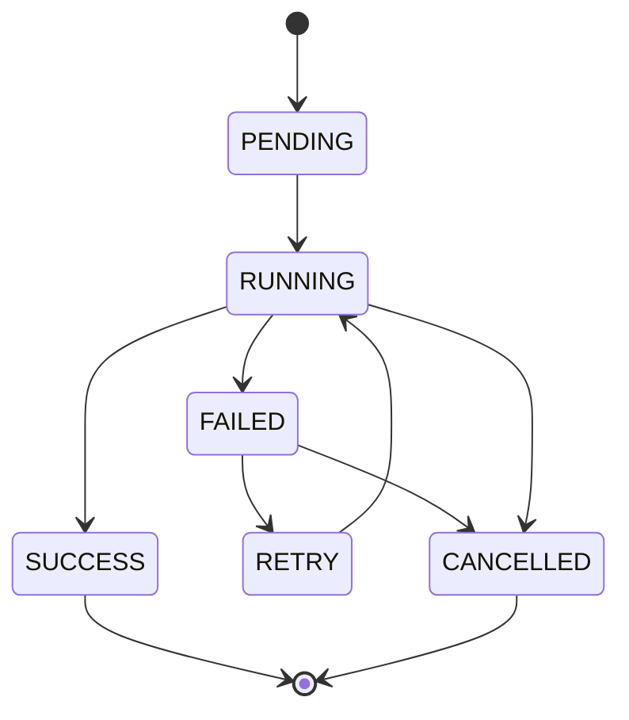

# Jarvis 企业级 AI 平台 - AI 应用能力设计文档

## 1. 概述

### 1.1 文档目的

本文档描述 Jarvis 企业级 AI 平台的 AI 应用能力设计，包括 Agent 工作流设计、任务状态机与幂等性、异步处理与重试、用户交互与结果闭环等核心应用能力。

### 1.2 设计目标

1. **可靠性**：工作流可靠执行，支持重试和恢复
2. **灵活性**：支持复杂业务场景，条件分支、循环、并行
3. **可观测性**：完整的任务状态追踪和日志
4. **用户体验**：多种交互模式，实时反馈
5. **幂等性**：保证任务执行的幂等性

---

## 2. Agent 工作流设计

### 2.1 工作流定义

#### 2.1.1 YAML 格式

**工作流定义示例**：
```yaml
name: document_qa_workflow
version: v1.0.0
description: 文档问答工作流
inputs:
  - name: user_query
    type: string
    required: true
outputs:
  - name: answer
    type: string

steps:
  - name: retrieve_context
    type: rag_retrieve
    inputs:
      query: ${user_query}
      top_k: 5
    outputs:
      context: ${retrieved_docs}
    timeout: 5s
    retry:
      max_attempts: 3
      backoff: exponential
      initial_interval: 1s
  
  - name: generate_answer
    type: llm_call
    inputs:
      prompt: |
        基于以下上下文回答用户的问题。
        上下文：${context}
        问题：${user_query}
      model: gpt-4
    outputs:
      answer: ${llm_response}
    timeout: 10s
  
  - name: validate_answer
    type: condition
    condition: ${answer.length > 10}
    on_true: return_answer
    on_false: fallback
  
  - name: return_answer
    type: return
    value: ${answer}
  
  - name: fallback
    type: return
    value: "无法生成有效答案"
```

#### 2.1.2 工作流类型

**1. 顺序执行**：
```yaml
steps:
  - name: step1
    type: task
  - name: step2
    type: task
    depends_on: [step1]
  - name: step3
    type: task
    depends_on: [step2]
```

**2. 并行执行**：
```yaml
steps:
  - name: step1
    type: task
  - name: step2
    type: task
    depends_on: [step1]
  - name: step3
    type: task
    depends_on: [step1]
  - name: step4
    type: task
    depends_on: [step2, step3]
```

**3. 条件分支**：
```yaml
steps:
  - name: check_condition
    type: condition
    condition: ${value > 0}
    on_true: positive_path
    on_false: negative_path
  
  - name: positive_path
    type: task
    depends_on: [check_condition]
  
  - name: negative_path
    type: task
    depends_on: [check_condition]
```

**4. 循环控制**：
```yaml
steps:
  - name: loop_start
    type: for_loop
    items: ${items}
    item_var: item
    steps:
      - name: process_item
        type: task
        inputs:
          item: ${item}
```

### 2.2 工作流引擎能力

#### 2.2.1 条件分支

**if/else**：
```python
class IfElseStep:
    def execute(self, condition: str, context: dict) -> str:
        """执行条件分支"""
        result = eval(condition, context)
        if result:
            return "on_true"
        else:
            return "on_false"
```

**switch**：
```python
class SwitchStep:
    def execute(self, value: str, cases: dict, context: dict) -> str:
        """执行 switch 分支"""
        evaluated_value = eval(value, context)
        return cases.get(evaluated_value, cases.get("default"))
```

#### 2.2.2 循环控制

**for 循环**：
```python
class ForLoopStep:
    def execute(self, items: list, steps: list, context: dict):
        """执行 for 循环"""
        results = []
        for item in items:
            item_context = {**context, "item": item, "index": items.index(item)}
            for step in steps:
                result = step.execute(item_context)
                results.append(result)
        return results
```

**while 循环**：
```python
class WhileLoopStep:
    def execute(self, condition: str, steps: list, context: dict, max_iterations: int = 100):
        """执行 while 循环"""
        iteration = 0
        while eval(condition, context) and iteration < max_iterations:
            for step in steps:
                step.execute(context)
            iteration += 1
        return iteration
```

#### 2.2.3 并行执行

**fork/join**：
```python
import asyncio

class ParallelStep:
    async def execute(self, branches: list, context: dict):
        """并行执行多个分支"""
        tasks = [branch.execute(context) for branch in branches]
        results = await asyncio.gather(*tasks)
        return results
```

#### 2.2.4 错误处理

**try/catch**：
```python
class TryCatchStep:
    def execute(self, try_steps: list, catch_steps: list, context: dict):
        """执行 try/catch"""
        try:
            for step in try_steps:
                step.execute(context)
        except Exception as e:
            error_context = {**context, "error": str(e)}
            for step in catch_steps:
                step.execute(error_context)
```

#### 2.2.5 超时控制

**步骤级超时**：
```python
import asyncio

class TimeoutStep:
    async def execute(self, step, timeout: float, context: dict):
        """带超时的步骤执行"""
        try:
            return await asyncio.wait_for(
                step.execute(context),
                timeout=timeout
            )
        except asyncio.TimeoutError:
            raise TimeoutError(f"Step {step.name} timed out after {timeout}s")
```

### 2.3 工作流示例

#### 2.3.1 文档问答工作流

```yaml
name: document_qa
steps:
  - name: retrieve
    type: rag_retrieve
    inputs:
      query: ${query}
      top_k: 5
  
  - name: generate
    type: llm_call
    inputs:
      prompt: "基于上下文回答问题: ${retrieve.context}"
  
  - name: return
    type: return
    value: ${generate.answer}
```

#### 2.3.2 数据分析工作流

```yaml
name: data_analysis
steps:
  - name: fetch_data
    type: data_fetch
    inputs:
      source: ${data_source}
  
  - name: analyze
    type: parallel
    branches:
      - name: stats
        type: calculate_stats
        inputs:
          data: ${fetch_data.data}
      - name: visualization
        type: create_chart
        inputs:
          data: ${fetch_data.data}
  
  - name: generate_report
    type: llm_call
    inputs:
      prompt: |
        基于以下数据分析结果生成报告：
        统计：${analyze.stats}
        图表：${analyze.visualization}
  
  - name: return
    type: return
    value: ${generate_report.report}
```

#### 2.3.3 自动化任务工作流

```yaml
name: automation_task
steps:
  - name: check_condition
    type: condition
    condition: ${should_process}
    on_true: process
    on_false: skip
  
  - name: process
    type: for_loop
    items: ${items}
    steps:
      - name: process_item
        type: task
        inputs:
          item: ${item}
        retry:
          max_attempts: 3
  
  - name: skip
    type: return
    value: "Skipped"
```

---

## 3. 任务状态机与幂等

### 3.1 任务状态机

#### 3.1.1 状态定义

**状态流转图**：


**状态说明**：

| 状态 | 说明 | 可转换状态 |
|------|------|------------|
| **PENDING** | 任务已创建，等待执行 | RUNNING, CANCELLED |
| **RUNNING** | 任务执行中 | SUCCESS, FAILED, CANCELLED |
| **SUCCESS** | 任务成功完成 | - |
| **FAILED** | 任务执行失败 | RETRY, CANCELLED |
| **RETRY** | 任务重试中 | RUNNING, CANCELLED |
| **CANCELLED** | 任务已取消 | - |

#### 3.1.2 状态实现

**状态机实现**：
```python
from enum import Enum
from dataclasses import dataclass
from datetime import datetime

class TaskStatus(Enum):
    PENDING = "pending"
    RUNNING = "running"
    SUCCESS = "success"
    FAILED = "failed"
    RETRY = "retry"
    CANCELLED = "cancelled"

@dataclass
class Task:
    id: str
    workflow_id: str
    status: TaskStatus
    created_at: datetime
    started_at: datetime = None
    completed_at: datetime = None
    retry_count: int = 0
    max_retries: int = 3
    error: str = None

class TaskStateMachine:
    def __init__(self, task: Task):
        self.task = task
    
    def transition(self, new_status: TaskStatus) -> bool:
        """状态转换"""
        valid_transitions = {
            TaskStatus.PENDING: [TaskStatus.RUNNING, TaskStatus.CANCELLED],
            TaskStatus.RUNNING: [TaskStatus.SUCCESS, TaskStatus.FAILED, TaskStatus.CANCELLED],
            TaskStatus.FAILED: [TaskStatus.RETRY, TaskStatus.CANCELLED],
            TaskStatus.RETRY: [TaskStatus.RUNNING, TaskStatus.CANCELLED],
        }
        
        if new_status not in valid_transitions.get(self.task.status, []):
            return False
        
        self.task.status = new_status
        
        # 更新时间戳
        if new_status == TaskStatus.RUNNING:
            self.task.started_at = datetime.now()
        elif new_status in [TaskStatus.SUCCESS, TaskStatus.FAILED, TaskStatus.CANCELLED]:
            self.task.completed_at = datetime.now()
        
        return True
```

### 3.2 幂等性保证

#### 3.2.1 任务 ID

**全局唯一任务 ID**：
```python
import uuid
from datetime import datetime

def generate_task_id(workflow_id: str, inputs: dict) -> str:
    """生成任务 ID"""
    # 基于工作流 ID 和输入生成确定性 ID
    content = f"{workflow_id}:{json.dumps(inputs, sort_keys=True)}"
    task_hash = hashlib.sha256(content.encode()).hexdigest()[:16]
    return f"{workflow_id}_{task_hash}"
```

#### 3.2.2 去重检查

**Redis Set 去重**：
```python
class TaskDeduplicator:
    def __init__(self, redis_client):
        self.redis = redis_client
        self.ttl = 86400  # 24小时
    
    async def is_duplicate(self, task_id: str) -> bool:
        """检查任务是否重复"""
        key = f"task:dedup:{task_id}"
        exists = await self.redis.exists(key)
        
        if not exists:
            await self.redis.setex(key, self.ttl, "1")
            return False
        
        return True
    
    async def mark_completed(self, task_id: str):
        """标记任务完成"""
        key = f"task:dedup:{task_id}"
        await self.redis.setex(key, self.ttl, "completed")
```

#### 3.2.3 状态校验

**重复提交检查**：
```python
class TaskService:
    async def submit_task(self, workflow_id: str, inputs: dict) -> str:
        """提交任务"""
        task_id = generate_task_id(workflow_id, inputs)
        
        # 检查是否已存在
        existing_task = await self.get_task(task_id)
        if existing_task:
            # 返回已有任务 ID
            return task_id
        
        # 检查去重
        if await self.deduplicator.is_duplicate(task_id):
            raise DuplicateTaskError(f"Task {task_id} already exists")
        
        # 创建新任务
        task = Task(
            id=task_id,
            workflow_id=workflow_id,
            status=TaskStatus.PENDING,
            created_at=datetime.now()
        )
        
        await self.save_task(task)
        await self.queue.enqueue(task_id)
        
        return task_id
```

#### 3.2.4 结果缓存

**相同输入返回缓存结果**：
```python
class TaskCache:
    def __init__(self, redis_client):
        self.redis = redis_client
        self.ttl = 3600  # 1小时
    
    async def get_cached_result(self, task_id: str) -> Optional[dict]:
        """获取缓存结果"""
        key = f"task:result:{task_id}"
        result = await self.redis.get(key)
        if result:
            return json.loads(result)
        return None
    
    async def cache_result(self, task_id: str, result: dict):
        """缓存结果"""
        key = f"task:result:{task_id}"
        await self.redis.setex(
            key,
            self.ttl,
            json.dumps(result)
        )
```

---

## 4. 异步处理与重试

### 4.1 异步任务队列

#### 4.1.1 任务提交

**立即返回任务 ID**：
```python
@router.post("/api/v1/workflows/{workflow_id}/execute")
async def execute_workflow(
    workflow_id: str,
    inputs: dict,
    async_mode: bool = True
):
    """执行工作流"""
    if async_mode:
        # 异步模式：立即返回任务 ID
        task_id = await task_service.submit_task(workflow_id, inputs)
        return {
            "task_id": task_id,
            "status": "pending",
            "status_url": f"/api/v1/tasks/{task_id}/status"
        }
    else:
        # 同步模式：等待执行完成
        result = await workflow_engine.execute(workflow_id, inputs)
        return {"result": result}
```

#### 4.1.2 状态查询

**轮询查询**：
```python
@router.get("/api/v1/tasks/{task_id}/status")
async def get_task_status(task_id: str):
    """获取任务状态"""
    task = await task_service.get_task(task_id)
    if not task:
        raise HTTPException(status_code=404, detail="Task not found")
    
    return {
        "task_id": task_id,
        "status": task.status.value,
        "progress": task.progress,
        "created_at": task.created_at.isoformat(),
        "started_at": task.started_at.isoformat() if task.started_at else None,
        "completed_at": task.completed_at.isoformat() if task.completed_at else None,
        "result_url": f"/api/v1/tasks/{task_id}/result" if task.status == TaskStatus.SUCCESS else None
    }
```

**WebSocket 推送**：
```python
from fastapi import WebSocket

@router.websocket("/ws/tasks/{task_id}")
async def task_status_websocket(websocket: WebSocket, task_id: str):
    """WebSocket 推送任务状态"""
    await websocket.accept()
    
    try:
        while True:
            task = await task_service.get_task(task_id)
            
            await websocket.send_json({
                "status": task.status.value,
                "progress": task.progress
            })
            
            if task.status in [TaskStatus.SUCCESS, TaskStatus.FAILED, TaskStatus.CANCELLED]:
                break
            
            await asyncio.sleep(1)  # 每秒推送一次
    except Exception as e:
        await websocket.close()
```

#### 4.1.3 结果获取

**获取任务结果**：
```python
@router.get("/api/v1/tasks/{task_id}/result")
async def get_task_result(task_id: str):
    """获取任务结果"""
    task = await task_service.get_task(task_id)
    
    if task.status != TaskStatus.SUCCESS:
        raise HTTPException(
            status_code=400,
            detail=f"Task status is {task.status.value}, not success"
        )
    
    # 尝试从缓存获取
    cached_result = await task_cache.get_cached_result(task_id)
    if cached_result:
        return cached_result
    
    # 从数据库获取
    result = await task_service.get_task_result(task_id)
    return result
```

### 4.2 重试策略

#### 4.2.1 指数退避

**指数退避实现**：
```python
import asyncio
import random

class ExponentialBackoff:
    def __init__(
        self,
        initial_interval: float = 1.0,
        max_interval: float = 60.0,
        multiplier: float = 2.0,
        jitter: bool = True
    ):
        self.initial_interval = initial_interval
        self.max_interval = max_interval
        self.multiplier = multiplier
        self.jitter = jitter
    
    def get_delay(self, attempt: int) -> float:
        """计算延迟时间"""
        delay = self.initial_interval * (self.multiplier ** attempt)
        delay = min(delay, self.max_interval)
        
        if self.jitter:
            # 添加随机抖动，避免雷群效应
            delay = delay * (0.5 + random.random() * 0.5)
        
        return delay

# 使用示例
backoff = ExponentialBackoff(initial_interval=1.0, max_interval=60.0)

for attempt in range(5):
    try:
        result = await execute_task()
        break
    except Exception as e:
        if attempt == 4:  # 最后一次尝试
            raise
        delay = backoff.get_delay(attempt)
        await asyncio.sleep(delay)
```

#### 4.2.2 最大重试

**重试配置**：
```python
class RetryConfig:
    def __init__(
        self,
        max_attempts: int = 3,
        backoff: str = "exponential",
        initial_interval: float = 1.0,
        retryable_errors: List[Type[Exception]] = None
    ):
        self.max_attempts = max_attempts
        self.backoff = backoff
        self.initial_interval = initial_interval
        self.retryable_errors = retryable_errors or [Exception]

class TaskExecutor:
    async def execute_with_retry(
        self,
        task: Task,
        retry_config: RetryConfig
    ):
        """带重试的任务执行"""
        last_error = None
        
        for attempt in range(retry_config.max_attempts):
            try:
                result = await self._execute_task(task)
                return result
            except Exception as e:
                last_error = e
                
                # 检查是否可重试
                if not isinstance(e, tuple(retry_config.retryable_errors)):
                    raise
                
                # 最后一次尝试，不再重试
                if attempt == retry_config.max_attempts - 1:
                    break
                
                # 计算延迟
                if retry_config.backoff == "exponential":
                    delay = retry_config.initial_interval * (2 ** attempt)
                else:
                    delay = retry_config.initial_interval
                
                await asyncio.sleep(delay)
        
        # 所有重试都失败
        raise TaskExecutionError(f"Task failed after {retry_config.max_attempts} attempts") from last_error
```

#### 4.2.3 重试条件

**可重试错误判断**：
```python
def is_retryable_error(error: Exception) -> bool:
    """判断错误是否可重试"""
    retryable_errors = [
        ConnectionError,
        TimeoutError,
        HTTPException,  # 5xx 错误
    ]
    
    # 网络错误可重试
    if isinstance(error, (ConnectionError, TimeoutError)):
        return True
    
    # HTTP 5xx 错误可重试
    if isinstance(error, HTTPException) and 500 <= error.status_code < 600:
        return True
    
    # 4xx 错误通常不可重试
    if isinstance(error, HTTPException) and 400 <= error.status_code < 500:
        return False
    
    return False
```

#### 4.2.4 死信队列

**死信队列处理**：
```python
class DeadLetterQueue:
    def __init__(self, redis_client):
        self.redis = redis_client
        self.queue_name = "dlq"
    
    async def add_failed_task(self, task_id: str, error: str):
        """添加失败任务到死信队列"""
        failed_task = {
            "task_id": task_id,
            "error": error,
            "failed_at": datetime.now().isoformat()
        }
        
        await self.redis.lpush(
            self.queue_name,
            json.dumps(failed_task)
        )
    
    async def process_dlq(self):
        """处理死信队列"""
        while True:
            task_json = await self.redis.brpop(self.queue_name, timeout=1)
            if task_json:
                task = json.loads(task_json[1])
                await self._handle_failed_task(task)
    
    async def _handle_failed_task(self, task: dict):
        """处理失败任务"""
        # 记录日志
        logger.error(f"Failed task: {task['task_id']}, Error: {task['error']}")
        
        # 发送告警
        await send_alert(
            type="task_failed",
            task_id=task["task_id"],
            error=task["error"]
        )
        
        # 可选：人工介入
        await notify_admin(task)
```

---

## 5. 用户交互与结果闭环

### 5.1 交互模式

#### 5.1.1 同步模式

**短任务立即返回**：
```python
@router.post("/api/v1/chat")
async def chat_sync(query: str):
    """同步聊天接口"""
    # 短任务，立即返回结果
    result = await rag_service.query(query)
    return {"answer": result}
```

#### 5.1.2 异步模式

**长任务返回任务 ID**：
```python
@router.post("/api/v1/workflows/execute")
async def execute_workflow_async(workflow_id: str, inputs: dict):
    """异步执行工作流"""
    task_id = await workflow_service.submit_task(workflow_id, inputs)
    return {
        "task_id": task_id,
        "status_url": f"/api/v1/tasks/{task_id}/status"
    }
```

#### 5.1.3 流式模式

**SSE 实时推送**：
```python
from fastapi.responses import StreamingResponse

@router.get("/api/v1/chat/stream")
async def chat_stream(query: str):
    """流式聊天接口"""
    async def generate():
        async for chunk in rag_service.query_stream(query):
            yield f"data: {json.dumps({'chunk': chunk})}\n\n"
        yield "data: [DONE]\n\n"
    
    return StreamingResponse(
        generate(),
        media_type="text/event-stream"
    )
```

**WebSocket 实时推送**：
```python
@router.websocket("/ws/chat")
async def chat_websocket(websocket: WebSocket):
    """WebSocket 聊天接口"""
    await websocket.accept()
    
    try:
        while True:
            data = await websocket.receive_json()
            query = data.get("query")
            
            async for chunk in rag_service.query_stream(query):
                await websocket.send_json({"chunk": chunk})
            
            await websocket.send_json({"done": True})
    except Exception as e:
        await websocket.close()
```

#### 5.1.4 轮询模式

**客户端定时查询**：
```javascript
// 客户端轮询示例
async function pollTaskStatus(taskId) {
    const pollInterval = 1000; // 1秒
    const maxAttempts = 60; // 最多60次
    
    for (let i = 0; i < maxAttempts; i++) {
        const response = await fetch(`/api/v1/tasks/${taskId}/status`);
        const status = await response.json();
        
        if (status.status === 'success') {
            return await fetch(`/api/v1/tasks/${taskId}/result`);
        } else if (status.status === 'failed') {
            throw new Error('Task failed');
        }
        
        await new Promise(resolve => setTimeout(resolve, pollInterval));
    }
    
    throw new Error('Task timeout');
}
```

### 5.2 结果闭环

#### 5.2.1 结果存储

**任务结果持久化**：
```python
class TaskResultStorage:
    async def save_result(self, task_id: str, result: dict):
        """保存任务结果"""
        # 保存到数据库
        await db.execute(
            "INSERT INTO task_results (task_id, result, created_at) VALUES (?, ?, ?)",
            (task_id, json.dumps(result), datetime.now())
        )
        
        # 保存到缓存
        await task_cache.cache_result(task_id, result)
        
        # 保存到对象存储（大结果）
        if len(json.dumps(result)) > 1024 * 1024:  # 1MB
            s3_key = f"task_results/{task_id}.json"
            await s3.put_object(s3_key, json.dumps(result))
```

#### 5.2.2 结果通知

**Webhook 通知**：
```python
class WebhookNotifier:
    async def notify_task_completed(self, task_id: str, result: dict):
        """Webhook 通知任务完成"""
        task = await task_service.get_task(task_id)
        webhook_url = task.webhook_url
        
        if webhook_url:
            await httpx.post(
                webhook_url,
                json={
                    "task_id": task_id,
                    "status": "completed",
                    "result": result
                },
                timeout=10.0
            )
```

**邮件通知**：
```python
class EmailNotifier:
    async def notify_task_completed(self, task_id: str, result: dict):
        """邮件通知任务完成"""
        task = await task_service.get_task(task_id)
        user_email = task.user_email
        
        if user_email:
            await send_email(
                to=user_email,
                subject=f"Task {task_id} Completed",
                body=f"Your task has been completed. Result: {result}"
            )
```

#### 5.2.3 结果反馈

**用户评分**：
```python
@router.post("/api/v1/tasks/{task_id}/feedback")
async def submit_feedback(
    task_id: str,
    rating: int,  # 1-5
    comment: str = None
):
    """提交任务反馈"""
    await feedback_service.save_feedback(
        task_id=task_id,
        rating=rating,
        comment=comment
    )
    
    # 更新任务质量指标
    await metrics_service.update_task_quality(task_id, rating)
    
    return {"status": "success"}
```

**错误反馈**：
```python
@router.post("/api/v1/tasks/{task_id}/error-report")
async def report_error(
    task_id: str,
    error_description: str
):
    """报告任务错误"""
    await error_service.report_error(
        task_id=task_id,
        description=error_description
    )
    
    # 触发错误分析
    await error_analyzer.analyze_error(task_id)
    
    return {"status": "reported"}
```

#### 5.2.4 效果优化

**基于反馈优化**：
```python
class FeedbackOptimizer:
    async def optimize_based_on_feedback(self):
        """基于反馈优化模型和 Prompt"""
        # 获取低评分任务
        low_rated_tasks = await feedback_service.get_low_rated_tasks(threshold=3)
        
        # 分析问题
        issues = await self._analyze_issues(low_rated_tasks)
        
        # 优化 Prompt
        if "prompt_issue" in issues:
            await prompt_optimizer.optimize_prompt(issues["prompt_issue"])
        
        # 优化模型选择
        if "model_issue" in issues:
            await model_router.optimize_routing(issues["model_issue"])
```

---

## 6. 总结

本文档描述了 Jarvis 企业级 AI 平台的 AI 应用核心能力：

1. **Agent 工作流设计**：支持条件分支、循环、并行、错误处理、超时控制
2. **任务状态机**：完整的状态流转，支持重试和恢复
3. **幂等性保证**：任务 ID、去重检查、状态校验、结果缓存
4. **异步处理**：任务队列、状态查询、结果获取
5. **重试策略**：指数退避、最大重试、重试条件、死信队列
6. **用户交互**：同步、异步、流式、轮询多种模式
7. **结果闭环**：结果存储、通知、反馈、优化

这些能力确保了应用的可靠性、灵活性和用户体验，为企业级 AI 应用提供了完整的应用层支撑。

---

## 附录

### A. 工作流示例库

详见工作流示例文档

### B. API 接口文档

详见 API 接口文档

### C. 错误码定义

详见错误码文档
