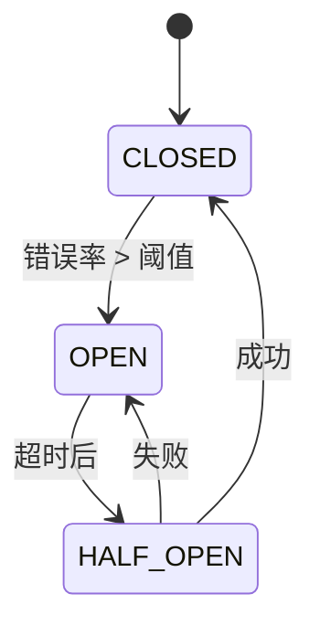

# Jarvis 企业级 AI 平台 - 稳定性与高并发设计文档

## 1. 概述

### 1.1 文档目的

本文档描述 Jarvis 企业级 AI 平台的稳定性与高并发设计，包括限流策略、排队机制、降级策略、熔断机制、热点保护、缓存策略、异常恢复等核心稳定性保障能力。

### 1.2 设计目标

1. **高可用性**：99.9%+ 可用性，多级容错
2. **高并发**：支持 1000+ QPS，弹性扩容
3. **稳定性**：限流、降级、熔断多重保护
4. **快速恢复**：自动故障检测与恢复
5. **性能优化**：多级缓存，降低延迟

---

## 2. 限流策略

### 2.1 多级限流

#### 2.1.1 网关层限流

**全局限流**：
```python
from fastapi import Request
from slowapi import Limiter, _rate_limit_exceeded_handler
from slowapi.util import get_remote_address

limiter = Limiter(key_func=get_remote_address)

@router.post("/api/v1/chat")
@limiter.limit("100/minute")
async def chat(request: Request, query: str):
    """聊天接口，每分钟100次"""
    return await chat_service.query(query)
```

**IP 限流**：
```python
@router.post("/api/v1/chat")
@limiter.limit("10/minute", key_func=lambda request: request.client.host)
async def chat(request: Request, query: str):
    """按 IP 限流，每分钟10次"""
    return await chat_service.query(query)
```

#### 2.1.2 服务层限流

**单服务限流**：
```python
class ServiceRateLimiter:
    def __init__(self, qps_limit: int = 100):
        self.qps_limit = qps_limit
        self.bucket = TokenBucket(capacity=qps_limit, refill_rate=qps_limit)
    
    async def check_limit(self) -> bool:
        """检查是否超过限制"""
        return self.bucket.consume()
    
    async def wait_if_needed(self):
        """如果需要，等待直到可以处理"""
        while not await self.check_limit():
            await asyncio.sleep(0.1)
```

#### 2.1.3 用户层限流

**单用户限流**：
```python
@router.post("/api/v1/chat")
async def chat(
    query: str,
    user_id: str = Depends(get_current_user_id)
):
    """用户级限流"""
    # 检查用户 QPS 限制
    user_qps_key = f"user_qps:{user_id}"
    current_qps = await redis_client.get(user_qps_key) or 0
    
    if int(current_qps) >= 10:  # 用户 QPS 限制为 10
        raise HTTPException(status_code=429, detail="Rate limit exceeded")
    
    await redis_client.incr(user_qps_key)
    await redis_client.expire(user_qps_key, 1)
    
    return await chat_service.query(query)
```

#### 2.1.4 租户层限流

**单租户限流**：
```python
@router.post("/api/v1/chat")
async def chat(
    query: str,
    tenant_id: str = Depends(get_tenant_id)
):
    """租户级限流"""
    # 获取租户配额
    quota = await quota_service.get_quota(tenant_id)
    tenant_qps_limit = quota["qps_limit"]
    
    # 检查租户 QPS
    tenant_qps_key = f"tenant_qps:{tenant_id}"
    current_qps = await redis_client.get(tenant_qps_key) or 0
    
    if int(current_qps) >= tenant_qps_limit:
        raise HTTPException(
            status_code=429,
            detail=f"Tenant QPS limit exceeded: {tenant_qps_limit}"
        )
    
    await redis_client.incr(tenant_qps_key)
    await redis_client.expire(tenant_qps_key, 1)
    
    return await chat_service.query(query)
```

### 2.2 限流算法

#### 2.2.1 令牌桶算法

**实现**：
```python
import time
import threading

class TokenBucket:
    def __init__(self, capacity: int, refill_rate: float):
        self.capacity = capacity
        self.refill_rate = refill_rate  # tokens per second
        self.tokens = capacity
        self.last_refill = time.time()
        self.lock = threading.Lock()
    
    def consume(self, tokens: int = 1) -> bool:
        """消费令牌"""
        with self.lock:
            now = time.time()
            elapsed = now - self.last_refill
            
            # 补充令牌
            self.tokens = min(
                self.capacity,
                self.tokens + elapsed * self.refill_rate
            )
            self.last_refill = now
            
            # 检查是否有足够令牌
            if self.tokens >= tokens:
                self.tokens -= tokens
                return True
            return False
```

**特点**：
- 允许突发流量（桶容量）
- 平滑限流（补充速率）
- 适合高并发场景

#### 2.2.2 漏桶算法

**实现**：
```python
class LeakyBucket:
    def __init__(self, capacity: int, leak_rate: float):
        self.capacity = capacity
        self.leak_rate = leak_rate  # requests per second
        self.queue = []
        self.last_leak = time.time()
        self.lock = threading.Lock()
    
    def add_request(self, request: dict) -> bool:
        """添加请求"""
        with self.lock:
            # 漏水
            self._leak()
            
            # 检查容量
            if len(self.queue) >= self.capacity:
                return False
            
            self.queue.append(request)
            return True
    
    def _leak(self):
        """漏水处理"""
        now = time.time()
        elapsed = now - self.last_leak
        leak_count = int(elapsed * self.leak_rate)
        
        # 移除请求
        self.queue = self.queue[leak_count:]
        self.last_leak = now
```

**特点**：
- 严格限流（固定输出速率）
- 平滑输出（无突发）
- 适合需要稳定输出的场景

#### 2.2.3 滑动窗口算法

**实现**：
```python
from collections import deque

class SlidingWindow:
    def __init__(self, window_size: int, max_requests: int):
        self.window_size = window_size  # seconds
        self.max_requests = max_requests
        self.requests = deque()
        self.lock = threading.Lock()
    
    def allow_request(self) -> bool:
        """检查是否允许请求"""
        with self.lock:
            now = time.time()
            
            # 移除过期请求
            while self.requests and self.requests[0] < now - self.window_size:
                self.requests.popleft()
            
            # 检查限制
            if len(self.requests) >= self.max_requests:
                return False
            
            # 添加请求
            self.requests.append(now)
            return True
```

**特点**：
- 精确限流（时间窗口内）
- 内存占用小（只存储时间戳）
- 适合精确控制场景

---

## 3. 排队机制

### 3.1 队列设计

#### 3.1.1 优先级队列

**实现**：
```python
import heapq
from dataclasses import dataclass, field
from typing import Any

@dataclass
class PriorityQueueItem:
    priority: int
    item: Any = field(compare=False)
    timestamp: float = field(default_factory=time.time, compare=False)

class PriorityQueue:
    def __init__(self):
        self.queue = []
        self.counter = 0
    
    def push(self, item: Any, priority: int = 0):
        """添加项目到优先级队列"""
        heapq.heappush(
            self.queue,
            (priority, self.counter, item)
        )
        self.counter += 1
    
    def pop(self) -> Any:
        """获取优先级最高的项目"""
        if not self.queue:
            return None
        _, _, item = heapq.heappop(self.queue)
        return item
    
    def size(self) -> int:
        """队列大小"""
        return len(self.queue)
```

**使用场景**：
- VIP 用户请求优先处理
- 高优先级任务优先执行
- 紧急请求优先响应

#### 3.1.2 超时队列

**实现**：
```python
class TimeoutQueue:
    def __init__(self, default_timeout: float = 60.0):
        self.queue = []
        self.default_timeout = default_timeout
    
    def add_request(self, request: dict, timeout: float = None):
        """添加请求"""
        if timeout is None:
            timeout = self.default_timeout
        
        expire_time = time.time() + timeout
        heapq.heappush(
            self.queue,
            (expire_time, request)
        )
    
    def get_expired_requests(self) -> List[dict]:
        """获取过期请求"""
        now = time.time()
        expired = []
        
        while self.queue and self.queue[0][0] <= now:
            expire_time, request = heapq.heappop(self.queue)
            expired.append(request)
        
        return expired
    
    def cancel_request(self, request_id: str):
        """取消请求"""
        self.queue = [
            (expire_time, req)
            for expire_time, req in self.queue
            if req.get("id") != request_id
        ]
        heapq.heapify(self.queue)
```

#### 3.1.3 死信队列

**实现**：
```python
class DeadLetterQueue:
    def __init__(self, redis_client):
        self.redis = redis_client
        self.queue_name = "dlq"
    
    async def add_failed_request(self, request: dict, error: str):
        """添加失败请求到死信队列"""
        failed_request = {
            **request,
            "error": error,
            "failed_at": datetime.now().isoformat(),
            "retry_count": request.get("retry_count", 0) + 1
        }
        
        await self.redis.lpush(
            self.queue_name,
            json.dumps(failed_request)
        )
    
    async def process_dlq(self):
        """处理死信队列"""
        while True:
            request_json = await self.redis.brpop(self.queue_name, timeout=1)
            if request_json:
                request = json.loads(request_json[1])
                await self._handle_failed_request(request)
```

### 3.2 排队策略

#### 3.2.1 FIFO（先进先出）

**实现**：
```python
from collections import deque

class FIFOQueue:
    def __init__(self):
        self.queue = deque()
    
    def enqueue(self, item: Any):
        """入队"""
        self.queue.append(item)
    
    def dequeue(self) -> Any:
        """出队"""
        if not self.queue:
            return None
        return self.queue.popleft()
```

#### 3.2.2 优先级调度

**实现**：
```python
class PriorityScheduler:
    def __init__(self):
        self.priority_queues = {
            "high": PriorityQueue(),
            "medium": PriorityQueue(),
            "low": PriorityQueue()
        }
    
    def schedule(self, item: Any, priority: str = "medium"):
        """调度项目"""
        self.priority_queues[priority].push(item)
    
    def get_next(self) -> Any:
        """获取下一个项目"""
        # 按优先级顺序检查
        for priority in ["high", "medium", "low"]:
            item = self.priority_queues[priority].pop()
            if item:
                return item
        return None
```

#### 3.2.3 公平调度

**实现**：
```python
class FairScheduler:
    def __init__(self):
        self.user_queues = defaultdict(deque)
        self.user_last_served = {}
    
    def enqueue(self, user_id: str, item: Any):
        """用户入队"""
        self.user_queues[user_id].append(item)
    
    def dequeue(self) -> Any:
        """公平出队"""
        if not self.user_queues:
            return None
        
        # 找到最久未服务的用户
        users = list(self.user_queues.keys())
        if not users:
            return None
        
        # 选择最久未服务的用户
        user_id = min(
            users,
            key=lambda u: self.user_last_served.get(u, 0)
        )
        
        # 从该用户队列出队
        item = self.user_queues[user_id].popleft()
        self.user_last_served[user_id] = time.time()
        
        # 如果用户队列为空，移除
        if not self.user_queues[user_id]:
            del self.user_queues[user_id]
        
        return item
```

---

## 4. 降级策略

### 4.1 降级场景

#### 4.1.1 LLM 服务降级

**降级链**：
```python
class LLMDegradationChain:
    def __init__(self):
        self.models = [
            "gpt-4",           # 主模型
            "gpt-3.5-turbo",   # 降级1
            "claude-haiku",    # 降级2
            "local-model"      # 降级3
        ]
    
    async def generate_with_fallback(self, prompt: str) -> str:
        """带降级的生成"""
        last_error = None
        
        for model in self.models:
            try:
                result = await self._call_model(model, prompt)
                return result
            except Exception as e:
                last_error = e
                logger.warning(f"Model {model} failed: {e}, trying next model")
                continue
        
        # 所有模型都失败
        raise Exception("All models failed") from last_error
```

#### 4.1.2 RAG 降级

**降级策略**：
```python
class RAGDegradation:
    async def retrieve_with_fallback(self, query: str) -> List[dict]:
        """带降级的检索"""
        try:
            # 尝试向量检索
            results = await vector_search(query, top_k=10)
            if results:
                return results
        except Exception as e:
            logger.warning(f"Vector search failed: {e}")
        
        try:
            # 降级到关键词检索
            results = await keyword_search(query, top_k=10)
            if results:
                return results
        except Exception as e:
            logger.warning(f"Keyword search failed: {e}")
        
        # 最后降级：返回空结果
        return []
```

#### 4.1.3 功能降级

**功能开关**：
```python
class FeatureToggle:
    def __init__(self):
        self.features = {
            "rerank": True,
            "hybrid_search": True,
            "cache": True
        }
    
    def is_enabled(self, feature: str) -> bool:
        """检查功能是否启用"""
        # 检查系统负载
        if self._is_high_load():
            # 高负载时禁用非核心功能
            if feature in ["rerank", "hybrid_search"]:
                return False
        
        return self.features.get(feature, False)
    
    def _is_high_load(self) -> bool:
        """检查是否高负载"""
        cpu_usage = get_cpu_usage()
        return cpu_usage > 0.8
```

### 4.2 降级触发

#### 4.2.1 错误率阈值

**实现**：
```python
class ErrorRateMonitor:
    def __init__(self, threshold: float = 0.5, window_size: int = 100):
        self.threshold = threshold
        self.window_size = window_size
        self.error_history = deque(maxlen=window_size)
    
    def record_result(self, success: bool):
        """记录结果"""
        self.error_history.append(0 if success else 1)
    
    def should_degrade(self) -> bool:
        """是否应该降级"""
        if len(self.error_history) < self.window_size:
            return False
        
        error_rate = sum(self.error_history) / len(self.error_history)
        return error_rate >= self.threshold
```

#### 4.2.2 延迟阈值

**实现**：
```python
class LatencyMonitor:
    def __init__(self, p95_threshold: float = 5.0):
        self.p95_threshold = p95_threshold
        self.latency_history = deque(maxlen=1000)
    
    def record_latency(self, latency: float):
        """记录延迟"""
        self.latency_history.append(latency)
    
    def should_degrade(self) -> bool:
        """是否应该降级"""
        if len(self.latency_history) < 100:
            return False
        
        sorted_latencies = sorted(self.latency_history)
        p95_index = int(len(sorted_latencies) * 0.95)
        p95_latency = sorted_latencies[p95_index]
        
        return p95_latency >= self.p95_threshold
```

#### 4.2.3 资源阈值

**实现**：
```python
class ResourceMonitor:
    def __init__(self):
        self.cpu_threshold = 0.8
        self.memory_threshold = 0.8
    
    def should_degrade(self) -> bool:
        """是否应该降级"""
        cpu_usage = get_cpu_usage()
        memory_usage = get_memory_usage()
        
        return cpu_usage >= self.cpu_threshold or memory_usage >= self.memory_threshold
```

---

## 5. 熔断机制

### 5.1 熔断器状态

**状态机**：


### 5.2 熔断器实现

**实现**：
```python
from enum import Enum
import time

class CircuitState(Enum):
    CLOSED = "closed"      # 正常状态
    OPEN = "open"          # 熔断状态
    HALF_OPEN = "half_open"  # 半开状态

class CircuitBreaker:
    def __init__(
        self,
        failure_threshold: int = 5,
        success_threshold: int = 2,
        timeout: float = 60.0,
        error_rate_threshold: float = 0.5
    ):
        self.failure_threshold = failure_threshold
        self.success_threshold = success_threshold
        self.timeout = timeout
        self.error_rate_threshold = error_rate_threshold
        
        self.state = CircuitState.CLOSED
        self.failure_count = 0
        self.success_count = 0
        self.last_failure_time = None
        self.error_history = deque(maxlen=100)
    
    def call(self, func, *args, **kwargs):
        """调用函数，带熔断保护"""
        if self.state == CircuitState.OPEN:
            # 检查是否超时
            if time.time() - self.last_failure_time > self.timeout:
                self.state = CircuitState.HALF_OPEN
                self.success_count = 0
            else:
                raise CircuitBreakerOpenError("Circuit breaker is OPEN")
        
        try:
            result = func(*args, **kwargs)
            self._on_success()
            return result
        except Exception as e:
            self._on_failure()
            raise
    
    def _on_success(self):
        """成功回调"""
        self.error_history.append(0)
        
        if self.state == CircuitState.HALF_OPEN:
            self.success_count += 1
            if self.success_count >= self.success_threshold:
                self.state = CircuitState.CLOSED
                self.failure_count = 0
        elif self.state == CircuitState.CLOSED:
            self.failure_count = 0
    
    def _on_failure(self):
        """失败回调"""
        self.error_history.append(1)
        self.failure_count += 1
        self.last_failure_time = time.time()
        
        # 计算错误率
        if len(self.error_history) >= 10:
            error_rate = sum(self.error_history) / len(self.error_history)
            if error_rate >= self.error_rate_threshold:
                self.state = CircuitState.OPEN
        
        # 或基于失败次数
        if self.failure_count >= self.failure_threshold:
            self.state = CircuitState.OPEN
```

---

## 6. 热点保护

### 6.1 热点识别

#### 6.1.1 实时监控

**QPS 突增检测**：
```python
class HotspotDetector:
    def __init__(self, threshold_multiplier: float = 2.0):
        self.threshold_multiplier = threshold_multiplier
        self.qps_history = defaultdict(deque)
    
    def record_request(self, endpoint: str):
        """记录请求"""
        now = time.time()
        self.qps_history[endpoint].append(now)
        
        # 只保留最近1分钟的数据
        while self.qps_history[endpoint] and \
              self.qps_history[endpoint][0] < now - 60:
            self.qps_history[endpoint].popleft()
    
    def detect_hotspot(self, endpoint: str) -> bool:
        """检测热点"""
        if endpoint not in self.qps_history:
            return False
        
        current_qps = len(self.qps_history[endpoint])
        
        # 计算平均 QPS（排除当前端点）
        avg_qps = sum(
            len(history) for ep, history in self.qps_history.items()
            if ep != endpoint
        ) / max(len(self.qps_history) - 1, 1)
        
        # 如果当前 QPS 超过平均值的倍数，认为是热点
        return current_qps >= avg_qps * self.threshold_multiplier
```

### 6.2 保护策略

#### 6.2.1 限流保护

**热点接口限流**：
```python
class HotspotProtection:
    def __init__(self):
        self.hotspot_limits = {}
    
    def protect_hotspot(self, endpoint: str):
        """保护热点接口"""
        if endpoint not in self.hotspot_limits:
            # 设置更严格的限流
            self.hotspot_limits[endpoint] = {
                "qps_limit": 10,  # 降低 QPS 限制
                "burst_limit": 5
            }
    
    def check_limit(self, endpoint: str) -> bool:
        """检查热点限流"""
        if endpoint in self.hotspot_limits:
            limit = self.hotspot_limits[endpoint]["qps_limit"]
            return self._check_qps(endpoint, limit)
        return True
```

#### 6.2.2 缓存保护

**热点数据缓存**：
```python
class HotspotCache:
    def __init__(self, ttl: int = 300):
        self.ttl = ttl
        self.cache = {}
    
    async def get_hotspot_data(self, key: str) -> Optional[Any]:
        """获取热点数据"""
        if key in self.cache:
            data, expire_time = self.cache[key]
            if time.time() < expire_time:
                return data
            else:
                del self.cache[key]
        return None
    
    async def set_hotspot_data(self, key: str, data: Any):
        """设置热点数据"""
        expire_time = time.time() + self.ttl
        self.cache[key] = (data, expire_time)
```

---

## 7. 缓存策略

### 7.1 三级缓存架构

详见《01-系统架构设计.md》缓存策略部分

### 7.2 缓存失效

#### 7.2.1 TTL 失效

**时间到期失效**：
```python
class TTLCache:
    def __init__(self, default_ttl: int = 3600):
        self.default_ttl = default_ttl
        self.cache = {}
    
    def set(self, key: str, value: Any, ttl: int = None):
        """设置缓存"""
        if ttl is None:
            ttl = self.default_ttl
        
        expire_time = time.time() + ttl
        self.cache[key] = (value, expire_time)
    
    def get(self, key: str) -> Optional[Any]:
        """获取缓存"""
        if key not in self.cache:
            return None
        
        value, expire_time = self.cache[key]
        if time.time() >= expire_time:
            del self.cache[key]
            return None
        
        return value
```

#### 7.2.2 主动失效

**数据更新时失效**：
```python
class CacheInvalidator:
    def __init__(self, cache_client):
        self.cache = cache_client
    
    async def invalidate_on_update(self, resource_type: str, resource_id: str):
        """更新时失效缓存"""
        # 失效相关缓存键
        patterns = [
            f"{resource_type}:{resource_id}:*",
            f"{resource_type}:list:*",
            f"search:{resource_type}:*"
        ]
        
        for pattern in patterns:
            await self.cache.delete_pattern(pattern)
```

---

## 8. 异常恢复

### 8.1 故障检测

#### 8.1.1 健康检查

**服务健康检查**：
```python
@router.get("/health")
async def health_check():
    """健康检查"""
    checks = {
        "database": await check_database(),
        "redis": await check_redis(),
        "qdrant": await check_qdrant(),
        "llm_api": await check_llm_api()
    }
    
    all_healthy = all(checks.values())
    status_code = 200 if all_healthy else 503
    
    return JSONResponse(
        status_code=status_code,
        content={
            "status": "healthy" if all_healthy else "unhealthy",
            "checks": checks
        }
    )
```

#### 8.1.2 指标监控

**Prometheus 指标**：
```python
from prometheus_client import Counter, Gauge, Histogram

error_counter = Counter(
    'service_errors_total',
    'Total service errors',
    ['service', 'error_type']
)

latency_histogram = Histogram(
    'service_latency_seconds',
    'Service latency',
    ['service']
)

cpu_gauge = Gauge(
    'service_cpu_usage',
    'CPU usage',
    ['service']
)
```

### 8.2 恢复策略

#### 8.2.1 自动重启

**K8s 重启策略**：
```yaml
apiVersion: apps/v1
kind: Deployment
spec:
  template:
    spec:
      containers:
      - name: app
        image: app:latest
        restartPolicy: Always
        livenessProbe:
          httpGet:
            path: /health
            port: 8000
          initialDelaySeconds: 30
          periodSeconds: 10
          failureThreshold: 3
```

#### 8.2.2 流量切换

**故障节点流量切换**：
```python
class TrafficSwitcher:
    async def switch_traffic_on_failure(self, failed_instance: str):
        """故障时切换流量"""
        # 从负载均衡器移除故障实例
        await load_balancer.remove_instance(failed_instance)
        
        # 通知其他实例
        await notify_instances(failed_instance, "removed")
        
        # 记录故障
        await log_failure(failed_instance)
```

---

## 9. 总结

本文档描述了 Jarvis 企业级 AI 平台的稳定性与高并发保障能力：

1. **限流策略**：多级限流（网关、服务、用户、租户），多种算法（令牌桶、漏桶、滑动窗口）
2. **排队机制**：优先级队列、超时队列、死信队列，多种调度策略（FIFO、优先级、公平）
3. **降级策略**：LLM 服务降级、RAG 降级、功能降级，基于错误率、延迟、资源阈值触发
4. **熔断机制**：CLOSED → OPEN → HALF_OPEN 状态流转，保护后端服务
5. **热点保护**：实时监控识别热点，限流、缓存、降级、隔离多重保护
6. **缓存策略**：三级缓存架构，TTL、主动失效、版本号多种失效策略
7. **异常恢复**：健康检查、指标监控、自动重启、流量切换

这些能力确保了系统的高可用性、高并发能力和快速恢复能力，为企业级 AI 应用提供了坚实的稳定性保障。

---

## 附录

### A. 性能指标

- **QPS**：单服务支持 1000+ QPS
- **延迟**：P95 < 2s，P99 < 5s
- **可用性**：99.9%+
- **错误率**：< 0.1%

### B. 限流配置示例

详见配置管理文档
