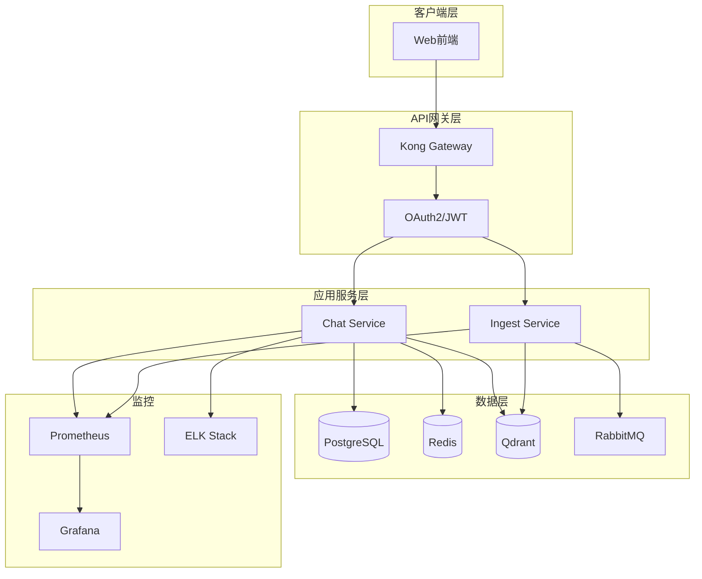
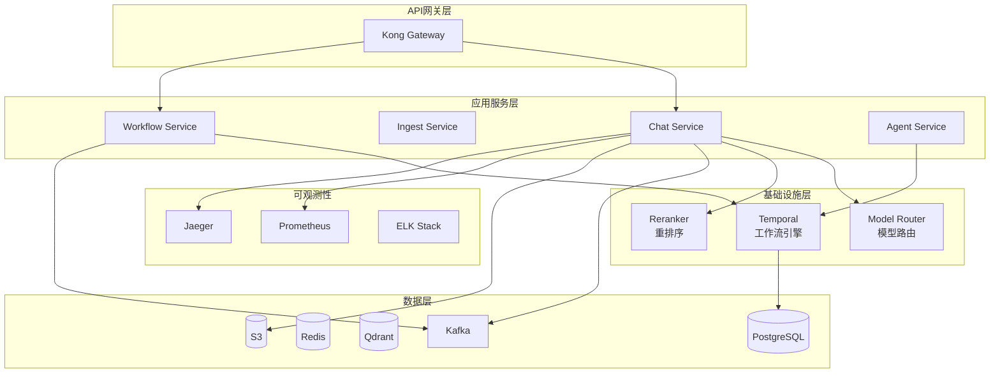
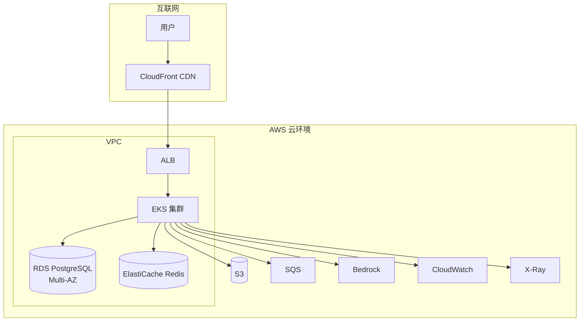

# Jarvis 企业级 AI 平台 - 架构演进路线文档

## 1. 概述

### 1.1 文档目的

本文档描述 Jarvis 企业级 AI 平台的架构演进路线，从 v0 MVP 版本逐步演进到 v3 云原生平台，说明每个版本的核心能力、技术栈、架构改进和演进原则。

### 1.2 演进原则

1. **渐进式演进**：每阶段新增能力，不破坏现有功能
2. **稳定性优先**：保证系统稳定性，平滑过渡
3. **技术选型**：考虑团队技术栈和业务需求
4. **成本平衡**：平衡性能、成本、复杂度
5. **可扩展性**：为未来扩展预留空间

---

## 2. v0 版本（当前 MVP）

### 2.1 核心能力

**已实现功能**：
- ✅ 基础 RAG 功能
- ✅ Qdrant 向量检索
- ✅ OpenAI API 集成
- ✅ FastAPI 基础服务
- ✅ SQLite 元数据存储
- ✅ Docker Compose 部署

### 2.2 技术栈

| 组件 | 技术选型 | 版本 |
|------|---------|------|
| Web 框架 | FastAPI | 0.100+ |
| 向量数据库 | Qdrant | 1.x |
| 关系数据库 | SQLite | 3.x |
| LLM API | OpenAI | - |
| 部署 | Docker Compose | - |

### 2.3 架构特点

**优点**：
- 快速上线，验证核心功能
- 部署简单，开发友好
- 技术栈轻量，学习成本低

**局限性**：
- ❌ 单租户架构，无法支持多客户
- ❌ 无权限控制，安全性不足
- ❌ 无配额管理，资源可能滥用
- ❌ 无监控告警，问题难以及时发现
- ❌ 无高可用保障，单点故障风险高
- ❌ SQLite 性能限制，不适合生产环境

### 2.4 适用场景

- 个人项目或小团队内部使用
- 功能验证和原型开发
- 学习和演示用途

---

## 3. v1 版本（企业级基础版）

### 3.1 新增能力

**核心新增**：
- ✅ 多租户架构（Row-level + Schema 混合隔离）
- ✅ RBAC 权限控制（角色层级、权限矩阵）
- ✅ Quota 配额管理（Token、QPS、存储、并发）
- ✅ 基础监控告警（Prometheus + Grafana）
- ✅ PostgreSQL 替换 SQLite（生产级数据库）
- ✅ Redis 缓存层（提升性能）
- ✅ 消息队列（RabbitMQ，异步任务处理）
- ✅ 基础限流熔断（保护系统稳定性）
- ✅ API Gateway（Kong，统一入口）
- ✅ 认证授权（OAuth2 + JWT）

### 3.2 技术栈升级

| 组件 | v0 技术 | v1 技术 | 升级原因 |
|------|---------|---------|----------|
| 关系数据库 | SQLite | PostgreSQL | 生产级性能、并发支持 |
| 缓存 | 无 | Redis | 提升性能、支持分布式 |
| 消息队列 | 无 | RabbitMQ | 异步任务处理 |
| 监控 | 无 | Prometheus + Grafana | 可观测性 |
| 日志 | 无 | ELK Stack | 日志聚合分析 |
| API 网关 | 无 | Kong | 统一入口、路由、认证 |

### 3.3 架构改进

**架构图**：


**关键改进**：
1. **多租户隔离**：Row-level + Schema 混合方案，平衡性能与隔离性
2. **权限控制**：RBAC 模型，细粒度权限管理
3. **配额管理**：Redis 计数器 + 令牌桶算法，防止资源滥用
4. **可观测性**：Prometheus 指标 + ELK 日志，基础监控能力

### 3.4 部署架构

**Kubernetes 部署**：
```yaml
apiVersion: apps/v1
kind: Deployment
metadata:
  name: jarvis-api
spec:
  replicas: 2
  template:
    spec:
      containers:
      - name: api
        image: jarvis-api:v1
        resources:
          requests:
            cpu: 500m
            memory: 1Gi
          limits:
            cpu: 2000m
            memory: 2Gi
```

### 3.5 性能指标

- **QPS**：单服务支持 100+ QPS
- **延迟**：P95 < 3s
- **可用性**：99%+（单区域部署）

---

## 4. v2 版本（生产级平台）

### 4.1 新增能力

**核心新增**：
- ✅ 工作流编排引擎（Temporal，可靠工作流执行）
- ✅ Agent 框架（YAML 定义、条件分支、循环、并行）
- ✅ 多模型路由与调度（成本优先、延迟优先、质量优先）
- ✅ RAG Rerank 优化（Cross-encoder，准确率提升 30%）
- ✅ 推理缓存优化（Token 成本降低 40%）
- ✅ 灰度发布机制（流量灰度、用户灰度、场景灰度）
- ✅ 完整可观测性（Metrics/Logs/Tracing 三位一体）
- ✅ 自动扩缩容（K8s HPA，应对流量高峰）
- ✅ 数据湖分析（S3 + Glue + Athena，使用情况分析）
- ✅ 微服务架构（服务拆分、独立部署）
- ✅ 事件驱动架构（Kafka，事件流处理）

### 4.2 技术栈升级

| 组件 | v1 技术 | v2 技术 | 升级原因 |
|------|---------|---------|----------|
| 工作流引擎 | 无 | Temporal | 可靠工作流执行 |
| 事件流 | RabbitMQ | Kafka | 高吞吐事件流 |
| 容器编排 | 本地 K8s | 自建 K8s | 生产级容器编排 |
| 链路追踪 | 无 | Jaeger | 分布式追踪 |
| 数据分析 | 无 | S3 + Glue + Athena | 数据湖分析 |
| 服务网格 | 无 | Istio（可选） | 服务间通信 |

### 4.3 架构改进

**架构图**：


**关键改进**：
1. **工作流引擎**：Temporal 保证任务可靠执行，支持复杂业务场景
2. **Agent 框架**：YAML 定义工作流，灵活可扩展
3. **多模型路由**：智能路由策略，平衡成本与质量
4. **RAG 优化**：混合检索 + Rerank，准确率提升 30%
5. **完整可观测性**：Metrics/Logs/Tracing 三位一体

### 4.4 性能指标

- **QPS**：单服务支持 500+ QPS
- **延迟**：P95 < 2s，P99 < 5s
- **可用性**：99.9%+（单区域高可用）

---

## 5. v3 版本（云原生平台 - AWS）

### 5.1 新增能力

**核心新增**：
- ✅ 全面上云 AWS（EKS、RDS、ElastiCache、S3）
- ✅ 多区域高可用部署（主/次/灾备区域）
- ✅ 云原生架构（托管服务、自动扩缩容）
- ✅ AWS Bedrock 集成（Claude、Llama 等模型）
- ✅ CloudWatch 监控（指标、日志、告警）
- ✅ X-Ray 链路追踪（分布式追踪）
- ✅ 成本优化（Reserved Instances、Spot Instances）
- ✅ 全球加速（CloudFront CDN、Route 53 路由）

### 5.2 技术栈升级

| 组件 | v2 技术 | v3 技术 | 升级原因 |
|------|---------|---------|----------|
| 容器编排 | 自建 K8s | AWS EKS | 托管服务，降低运维成本 |
| 关系数据库 | PostgreSQL | RDS PostgreSQL | Multi-AZ 高可用 |
| 缓存 | Redis | ElastiCache Redis | 托管服务，自动备份 |
| 消息队列 | RabbitMQ | SQS | 托管服务，按需扩展 |
| 事件流 | Kafka | MSK（可选） | 托管 Kafka |
| 对象存储 | S3 | S3 + 生命周期 | 成本优化 |
| 监控 | Prometheus | CloudWatch | AWS 原生监控 |
| 链路追踪 | Jaeger | X-Ray | AWS 原生追踪 |
| LLM 服务 | OpenAI | Bedrock + OpenAI | 多模型支持 |

### 5.3 架构改进

**云原生架构图**：


**关键改进**：
1. **托管服务**：RDS、ElastiCache、SQS 等托管服务，降低运维成本 60%
2. **多区域部署**：主/次/灾备区域，可用性 99.99%
3. **成本优化**：Reserved Instances、Spot Instances，成本降低 30-50%
4. **全球加速**：CloudFront CDN，降低延迟

### 5.4 迁移策略

**迁移阶段**：
1. **阶段一（3个月）**：基础设施上云
2. **阶段二（2个月）**：应用服务上云
3. **阶段三（2个月）**：数据与监控上云
4. **阶段四（1个月）**：优化与验证

**迁移方式**：
- 双写策略：迁移期间同时写入本地和云上
- 灰度迁移：按租户/功能逐步迁移
- 回滚方案：保留本地环境，支持快速回滚

### 5.5 性能指标

- **QPS**：单服务支持 1000+ QPS
- **延迟**：P95 < 2s，P99 < 5s
- **可用性**：99.99%+（多区域高可用）
- **成本优化**：30-50%（Reserved Instances + Spot）

---

## 6. 演进对比

### 6.1 功能对比

| 维度 | v0 (MVP) | v1 (企业级) | v2 (生产级) | v3 (云原生) |
|------|----------|-------------|-------------|-------------|
| **部署方式** | 本地 Docker | 本地 K8s | 自建 K8s | AWS EKS |
| **租户** | 单租户 | 多租户 | 多租户 + 企业级 | 多租户 + SaaS |
| **权限** | 无 | RBAC | RBAC + 细粒度 | IAM + RBAC |
| **高可用** | 无 | 基础 | 完整 | 多区域高可用 |
| **可观测性** | 无 | 基础监控 | 全链路追踪 | CloudWatch + X-Ray |
| **工作流** | 无 | 无 | 完整编排 | EventBridge 集成 |
| **Agent** | 无 | 无 | 完整框架 | Bedrock 集成 |
| **成本优化** | 无 | 基础 | 深度优化 | 云成本优化 |
| **数据分析** | 无 | 无 | 数据湖 | Athena + QuickSight |

### 6.2 技术栈对比

| 组件 | v0 | v1 | v2 | v3 |
|------|----|----|----|----|
| **存储** | SQLite | PostgreSQL | PostgreSQL | RDS Multi-AZ |
| **缓存** | 无 | Redis | Redis | ElastiCache |
| **消息队列** | 无 | RabbitMQ | Kafka | SQS + MSK |
| **对象存储** | 本地 | 本地 | S3 | S3 + 生命周期 |
| **网络** | 本地 | 本地 | 负载均衡 | ALB + CloudFront |
| **安全** | 基础 | 基础 | 完整 | IAM + WAF + Shield |
| **灾备** | 无 | 无 | 单区域 | 多区域灾备 |

### 6.3 性能对比

| 指标 | v0 | v1 | v2 | v3 |
|------|----|----|----|----|
| **QPS** | 10+ | 100+ | 500+ | 1000+ |
| **P95 延迟** | 5s+ | 3s | 2s | 2s |
| **可用性** | 95% | 99% | 99.9% | 99.99% |
| **成本优化** | - | - | 20% | 30-50% |

---

## 7. 演进时间线

### 7.1 v0 → v1（3-6 个月）

**重点任务**：
1. 多租户架构改造（1-2 个月）
2. 权限控制系统（1 个月）
3. 配额管理系统（1 个月）
4. 监控告警系统（1 个月）
5. 数据库迁移（1 个月）

**风险控制**：
- 双写策略，确保数据一致性
- 灰度发布，逐步切换流量
- 回滚方案，快速恢复

### 7.2 v1 → v2（6-9 个月）

**重点任务**：
1. 工作流引擎集成（2-3 个月）
2. Agent 框架开发（2 个月）
3. 多模型路由系统（1-2 个月）
4. RAG 优化（1 个月）
5. 完整可观测性（1 个月）

**风险控制**：
- 功能开关，控制新功能上线
- A/B 测试，验证新功能效果
- 逐步灰度，降低风险

### 7.3 v2 → v3（8-12 个月）

**重点任务**：
1. 基础设施上云（3 个月）
2. 应用服务上云（2 个月）
3. 数据与监控上云（2 个月）
4. 优化与验证（1 个月）

**风险控制**：
- 双写策略，确保数据一致性
- 灰度迁移，按租户逐步迁移
- 性能对比，确保不降级
- 回滚方案，支持快速回滚

---

## 8. 演进原则总结

### 8.1 渐进式演进

- 每阶段新增能力，不破坏现有功能
- 平滑过渡，保证系统稳定性
- 逐步验证，降低风险

### 8.2 技术选型

- 考虑团队技术栈和业务需求
- 平衡性能、成本、复杂度
- 优先选择成熟稳定的技术

### 8.3 成本平衡

- 平衡性能与成本
- 优化资源使用
- 控制运维成本

### 8.4 可扩展性

- 为未来扩展预留空间
- 支持水平扩展
- 架构灵活可调整

---

## 9. 总结

本文档描述了 Jarvis 企业级 AI 平台从 v0 MVP 到 v3 云原生平台的完整演进路线：

1. **v0（MVP）**：快速验证核心功能，技术栈轻量
2. **v1（企业级）**：多租户、权限控制、配额管理，基础监控
3. **v2（生产级）**：工作流引擎、Agent 框架、完整可观测性
4. **v3（云原生）**：全面上云 AWS，多区域高可用，成本优化

每个版本都在前一版本基础上新增能力，保证系统稳定性的同时逐步提升性能和可用性，最终实现企业级云原生 AI 平台。

---

## 附录

### A. 迁移检查清单

详见《08-云迁移方案.md》

### B. 技术选型对比

详见各版本技术选型文档

### C. 性能测试报告

详见性能测试文档
