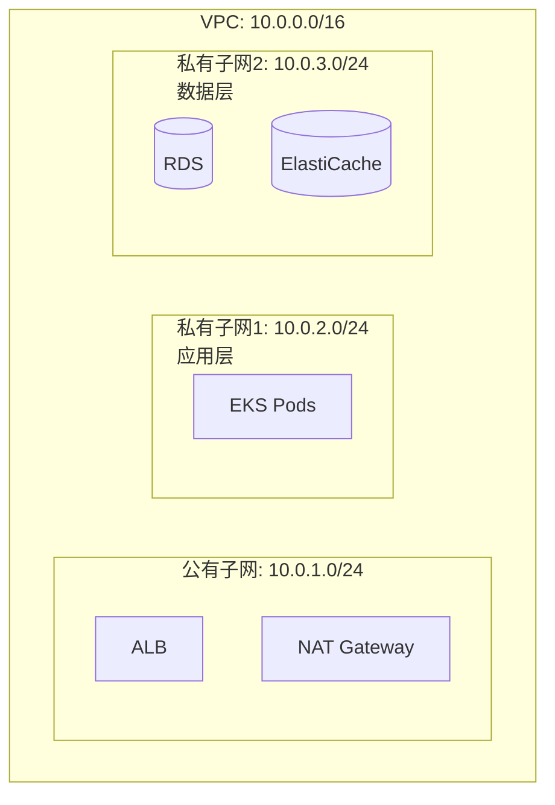

# Jarvis 企业级 AI 平台 - 云迁移方案文档

## 1. 概述

### 1.1 文档目的

本文档描述 Jarvis 企业级 AI 平台从本地部署迁移到 AWS 云平台的完整方案，包括 AWS 服务选型、迁移策略、成本优化、多区域部署等内容。

### 1.2 迁移目标

1. **全面上云**：基础设施和应用服务全面迁移到 AWS
2. **降低运维成本**：利用托管服务，降低运维成本 60%
3. **提升可用性**：多区域高可用部署，可用性达到 99.99%
4. **优化成本结构**：通过 Reserved Instances、Spot Instances 等策略优化成本 30-50%
5. **全球加速**：CloudFront CDN + 多区域部署，降低延迟

---

## 2. AWS 服务选型映射

### 2.1 计算服务

#### 2.1.1 EKS（Elastic Kubernetes Service）

**选型原因**：
- 托管 Kubernetes 服务，降低运维负担
- 自动扩缩容，应对流量高峰
- 与 AWS 服务深度集成

**配置示例**：
```yaml
apiVersion: eksctl.io/v1alpha5
kind: ClusterConfig
metadata:
  name: jarvis-cluster
  region: us-east-1
nodeGroups:
  - name: app-nodes
    instanceType: m5.large
    desiredCapacity: 3
    minSize: 2
    maxSize: 10
```

#### 2.1.2 Lambda（事件驱动函数）

**使用场景**：
- 文档处理任务
- 定时任务
- 事件触发处理

**配置示例**：
```python
import json
import boto3

def lambda_handler(event, context):
    """Lambda 函数处理文档"""
    s3 = boto3.client('s3')
    
    # 处理 S3 事件
    for record in event['Records']:
        bucket = record['s3']['bucket']['name']
        key = record['s3']['object']['key']
        
        # 处理文档
        process_document(bucket, key)
    
    return {'statusCode': 200}
```

#### 2.1.3 EC2（Qdrant 向量库）

**配置**：
- 实例类型：r5.xlarge（内存优化）
- 存储：EBS gp3，500GB
- 高可用：Multi-AZ 部署

### 2.2 存储服务

#### 2.2.1 RDS PostgreSQL

**配置**：
- 引擎：PostgreSQL 15+
- 实例类型：db.r5.xlarge
- Multi-AZ：启用（高可用）
- 备份：自动备份，7天保留期

**迁移步骤**：
```bash
# 1. 创建 RDS 实例
aws rds create-db-instance \
  --db-instance-identifier jarvis-postgres \
  --engine postgres \
  --engine-version 15.4 \
  --db-instance-class db.r5.xlarge \
  --multi-az \
  --allocated-storage 500

# 2. 数据迁移
pg_dump -h localhost -U postgres jarvis_db | \
  psql -h jarvis-postgres.xxx.rds.amazonaws.com -U postgres jarvis_db
```

#### 2.2.2 ElastiCache Redis

**配置**：
- 引擎：Redis 7.x
- 节点类型：cache.r6g.large
- 集群模式：启用（高可用）

**迁移步骤**：
```bash
# 1. 创建 ElastiCache 集群
aws elasticache create-cache-cluster \
  --cache-cluster-id jarvis-redis \
  --engine redis \
  --cache-node-type cache.r6g.large \
  --num-cache-nodes 3

# 2. 数据迁移
redis-cli --rdb dump.rdb
redis-cli -h jarvis-redis.xxx.cache.amazonaws.com --rdb dump.rdb
```

#### 2.2.3 S3 对象存储

**存储类别**：
- Standard：热数据，频繁访问
- Intelligent-Tiering：自动优化存储类别
- Glacier：归档数据，长期存储

**生命周期策略**：
```json
{
  "Rules": [
    {
      "Id": "Move to IA after 30 days",
      "Status": "Enabled",
      "Transitions": [
        {
          "Days": 30,
          "StorageClass": "STANDARD_IA"
        }
      ]
    },
    {
      "Id": "Move to Glacier after 90 days",
      "Status": "Enabled",
      "Transitions": [
        {
          "Days": 90,
          "StorageClass": "GLACIER"
        }
      ]
    }
  ]
}
```

### 2.3 网络服务

#### 2.3.1 VPC 网络架构

**架构设计**：


**配置示例**：
```bash
# 创建 VPC
aws ec2 create-vpc --cidr-block 10.0.0.0/16

# 创建子网
aws ec2 create-subnet --vpc-id vpc-xxx --cidr-block 10.0.1.0/24 --availability-zone us-east-1a
aws ec2 create-subnet --vpc-id vpc-xxx --cidr-block 10.0.2.0/24 --availability-zone us-east-1b
```

#### 2.3.2 ALB（Application Load Balancer）

**配置**：
- 类型：Application Load Balancer
- 监听器：HTTPS（443），HTTP（80）重定向到 HTTPS
- 目标组：EKS 服务

**配置示例**：
```yaml
apiVersion: v1
kind: Service
metadata:
  name: jarvis-api
  annotations:
    service.beta.kubernetes.io/aws-load-balancer-type: "nlb"
spec:
  type: LoadBalancer
  ports:
  - port: 80
    targetPort: 8000
  selector:
    app: jarvis-api
```

#### 2.3.3 CloudFront CDN

**配置**：
- 源：ALB
- 缓存策略：CachingOptimized
- SSL 证书：ACM 证书

**配置示例**：
```json
{
  "DistributionConfig": {
    "Origins": {
      "Items": [
        {
          "Id": "jarvis-alb",
          "DomainName": "jarvis-alb-xxx.us-east-1.elb.amazonaws.com",
          "CustomOriginConfig": {
            "HTTPPort": 80,
            "HTTPSPort": 443,
            "OriginProtocolPolicy": "https-only"
          }
        }
      ]
    },
    "DefaultCacheBehavior": {
      "TargetOriginId": "jarvis-alb",
      "ViewerProtocolPolicy": "redirect-to-https",
      "CachePolicyId": "658327ea-f89d-4fab-a63d-7e88639e58f6"
    }
  }
}
```

### 2.4 消息与事件

#### 2.4.1 SQS（Simple Queue Service）

**队列类型**：
- Standard Queue：高吞吐，至少一次传递
- FIFO Queue：严格顺序，恰好一次传递

**配置示例**：
```python
import boto3

sqs = boto3.client('sqs')

# 创建队列
queue = sqs.create_queue(
    QueueName='jarvis-chat-queue',
    Attributes={
        'VisibilityTimeout': '300',
        'MessageRetentionPeriod': '86400'
    }
)

# 发送消息
sqs.send_message(
    QueueUrl=queue['QueueUrl'],
    MessageBody=json.dumps({'task_id': '123', 'query': 'test'})
)
```

#### 2.4.2 EventBridge（事件总线）

**使用场景**：
- 工作流事件驱动
- 系统事件通知
- 跨服务通信

**配置示例**：
```python
import boto3

eventbridge = boto3.client('events')

# 创建规则
eventbridge.put_rule(
    Name='workflow-completed',
    EventPattern=json.dumps({
        'source': ['jarvis.workflow'],
        'detail-type': ['Workflow Completed']
    })
)

# 添加目标
eventbridge.put_targets(
    Rule='workflow-completed',
    Targets=[
        {
            'Id': '1',
            'Arn': 'arn:aws:lambda:us-east-1:xxx:function:notify-user'
        }
    ]
)
```

### 2.5 AI/ML 服务

#### 2.5.1 AWS Bedrock

**支持的模型**：
- Claude 3（Opus、Sonnet、Haiku）
- Llama 2
- Titan

**集成示例**：
```python
import boto3

bedrock = boto3.client('bedrock-runtime')

def call_bedrock(prompt: str, model: str = 'anthropic.claude-v2'):
    """调用 Bedrock"""
    response = bedrock.invoke_model(
        modelId=model,
        body=json.dumps({
            'prompt': prompt,
            'max_tokens': 1000
        })
    )
    
    result = json.loads(response['body'].read())
    return result['completion']
```

### 2.6 监控与可观测性

#### 2.6.1 CloudWatch

**指标监控**：
```python
import boto3

cloudwatch = boto3.client('cloudwatch')

# 推送自定义指标
cloudwatch.put_metric_data(
    Namespace='Jarvis',
    MetricData=[
        {
            'MetricName': 'TokenUsage',
            'Value': 1000,
            'Unit': 'Count',
            'Dimensions': [
                {'Name': 'Model', 'Value': 'gpt-4'},
                {'Name': 'Tenant', 'Value': 'tenant_123'}
            ]
        }
    ]
)
```

#### 2.6.2 X-Ray 链路追踪

**集成**：
```python
from aws_xray_sdk.core import xray_recorder
from aws_xray_sdk.core import patch_all

# 启用 X-Ray
patch_all()

@xray_recorder.capture('chat_handler')
async def chat_handler(query: str):
    """聊天处理函数"""
    # 自动追踪
    result = await process_query(query)
    return result
```

---

## 3. 迁移策略

### 3.1 迁移阶段

#### 3.1.1 阶段一：基础设施上云（3个月）

**任务清单**：
- [ ] VPC 网络架构设计
- [ ] EKS 容器集群搭建
- [ ] RDS PostgreSQL 迁移
- [ ] ElastiCache Redis 迁移
- [ ] S3 对象存储迁移
- [ ] IAM 角色与策略配置
- [ ] 安全组与 NACL 配置

**时间安排**：
- Week 1-2：VPC 和网络配置
- Week 3-4：EKS 集群搭建
- Week 5-6：RDS 迁移
- Week 7-8：ElastiCache 迁移
- Week 9-10：S3 迁移
- Week 11-12：测试与验证

#### 3.1.2 阶段二：应用服务上云（2个月）

**任务清单**：
- [ ] 应用容器化改造
- [ ] EKS 部署与配置
- [ ] ALB 负载均衡配置
- [ ] CloudFront CDN 配置
- [ ] 服务间通信配置
- [ ] 健康检查配置

**时间安排**：
- Week 1-2：容器化改造
- Week 3-4：EKS 部署
- Week 5-6：负载均衡与 CDN
- Week 7-8：测试与优化

#### 3.1.3 阶段三：数据与监控上云（2个月）

**任务清单**：
- [ ] Qdrant 向量库迁移（ECS/EC2）
- [ ] CloudWatch 监控集成
- [ ] CloudTrail 审计日志
- [ ] X-Ray 链路追踪
- [ ] 数据备份与恢复方案
- [ ] 告警规则配置

**时间安排**：
- Week 1-2：Qdrant 迁移
- Week 3-4：监控集成
- Week 5-6：审计日志
- Week 7-8：测试与优化

#### 3.1.4 阶段四：优化与验证（1个月）

**任务清单**：
- [ ] 性能调优
- [ ] 成本优化
- [ ] 安全加固
- [ ] 灾备演练
- [ ] 文档更新

### 3.2 迁移方式

#### 3.2.1 双写策略

**实现**：
```python
class DualWriteService:
    def __init__(self, local_db, cloud_db):
        self.local_db = local_db
        self.cloud_db = cloud_db
    
    async def write(self, data: dict):
        """双写数据"""
        # 同时写入本地和云上
        local_result = await self.local_db.write(data)
        cloud_result = await self.cloud_db.write(data)
        
        # 验证一致性
        if local_result != cloud_result:
            logger.error("Dual write inconsistency detected")
        
        return local_result
```

#### 3.2.2 灰度迁移

**迁移计划**：
```
Week 1: 10% 租户迁移到云上
Week 2: 30% 租户迁移到云上
Week 3: 50% 租户迁移到云上
Week 4: 100% 租户迁移到云上
```

**实现**：
```python
def should_use_cloud(tenant_id: str) -> bool:
    """判断租户是否使用云上服务"""
    migration_percentage = get_migration_percentage()
    tenant_hash = hash(tenant_id) % 100
    
    return tenant_hash < migration_percentage
```

#### 3.2.3 回滚方案

**回滚流程**：
1. 停止云上服务
2. 切换 DNS 到本地服务
3. 验证本地服务正常
4. 数据一致性检查

---

## 4. 成本优化策略

### 4.1 Reserved Instances

**节省**：30-50%

**配置**：
```bash
# 购买 Reserved Instances
aws ec2 purchase-reserved-instances-offering \
  --reserved-instances-offering-id xxxx \
  --instance-count 3 \
  --instance-type m5.large
```

### 4.2 Spot Instances

**节省**：70-90%

**使用场景**：
- 非关键任务
- 批处理任务
- 开发测试环境

**配置**：
```yaml
apiVersion: v1
kind: NodeGroup
spec:
  instancesDistribution:
    spotInstancePools: 5
    onDemandPercentageAboveBaseCapacity: 0
    spotAllocationStrategy: "capacity-optimized"
```

### 4.3 S3 生命周期

**自动转换存储类别**：
```json
{
  "Rules": [
    {
      "Id": "Transition to IA",
      "Status": "Enabled",
      "Transitions": [
        {
          "Days": 30,
          "StorageClass": "STANDARD_IA"
        },
        {
          "Days": 90,
          "StorageClass": "GLACIER"
        }
      ]
    }
  ]
}
```

### 4.4 成本监控

**Cost Explorer 配置**：
```python
import boto3

ce = boto3.client('ce')

# 获取成本数据
response = ce.get_cost_and_usage(
    TimePeriod={
        'Start': '2024-01-01',
        'End': '2024-01-31'
    },
    Granularity='MONTHLY',
    Metrics=['BlendedCost'],
    GroupBy=[
        {'Type': 'DIMENSION', 'Key': 'SERVICE'}
    ]
)
```

---

## 5. 多区域部署方案

### 5.1 区域选择

**主区域**：us-east-1（美国东部）
- 成本最低
- 服务最全
- 延迟适中

**次区域**：ap-southeast-1（亚太）
- 亚太用户低延迟
- 数据合规要求

**灾备区域**：eu-west-1（欧洲）
- 数据备份
- 故障恢复

### 5.2 数据同步

#### 5.2.1 RDS 跨区域只读副本

**配置**：
```bash
# 创建跨区域只读副本
aws rds create-db-instance-read-replica \
  --db-instance-identifier jarvis-postgres-replica \
  --source-db-instance-identifier jarvis-postgres \
  --region ap-southeast-1
```

#### 5.2.2 S3 跨区域复制

**配置**：
```json
{
  "Rules": [
    {
      "Id": "Replicate to ap-southeast-1",
      "Status": "Enabled",
      "Destination": {
        "Bucket": "arn:aws:s3:::jarvis-backup-ap-southeast-1",
        "Region": "ap-southeast-1"
      }
    }
  ]
}
```

### 5.3 流量路由

#### 5.3.1 Route 53 健康检查

**配置**：
```json
{
  "HealthCheckConfig": {
    "Type": "HTTPS",
    "ResourcePath": "/health",
    "FullyQualifiedDomainName": "api.jarvis.com",
    "RequestInterval": 30,
    "FailureThreshold": 3
  }
}
```

#### 5.3.2 Route 53 延迟路由

**配置**：
```json
{
  "RoutingPolicy": "LATENCY",
  "ResourceRecordSets": [
    {
      "Name": "api.jarvis.com",
      "Type": "A",
      "SetIdentifier": "us-east-1",
      "Region": "us-east-1",
      "AliasTarget": {
        "DNSName": "us-east-1-alb.xxx.elb.amazonaws.com"
      }
    },
    {
      "Name": "api.jarvis.com",
      "Type": "A",
      "SetIdentifier": "ap-southeast-1",
      "Region": "ap-southeast-1",
      "AliasTarget": {
        "DNSName": "ap-southeast-1-alb.xxx.elb.amazonaws.com"
      }
    }
  ]
}
```

---

## 6. 迁移检查清单

### 6.1 迁移前准备

- [ ] VPC 网络架构设计完成
- [ ] IAM 角色与策略设计完成
- [ ] 安全组与 NACL 配置完成
- [ ] 数据备份与恢复测试通过
- [ ] 迁移工具与脚本准备完成
- [ ] 团队培训完成

### 6.2 迁移执行

- [ ] 数据库迁移（RDS）完成
- [ ] 缓存迁移（ElastiCache）完成
- [ ] 对象存储迁移（S3）完成
- [ ] 应用容器化与部署（EKS）完成
- [ ] 监控与告警配置（CloudWatch）完成
- [ ] DNS 切换完成

### 6.3 迁移后验证

- [ ] 功能验证（所有功能正常）
- [ ] 性能验证（延迟、吞吐量）
- [ ] 安全验证（权限、加密）
- [ ] 成本验证（成本在预算内）
- [ ] 灾备演练（故障恢复测试）
- [ ] 文档更新完成

---

## 7. 迁移成果

### 7.1 运维成本

**降低**：60%
- 托管服务减少运维工作量
- 自动扩缩容减少人工干预
- 自动备份减少运维风险

### 7.2 可用性

**提升**：99.99%
- Multi-AZ 部署
- 多区域灾备
- 自动故障转移

### 7.3 成本优化

**节省**：30-50%
- Reserved Instances
- Spot Instances
- S3 生命周期管理

### 7.4 性能提升

**延迟降低**：30%
- CloudFront CDN 加速
- 多区域部署
- 优化网络路径

---

## 8. 总结

本文档描述了 Jarvis 企业级 AI 平台迁移到 AWS 云平台的完整方案：

1. **AWS 服务选型**：EKS、RDS、ElastiCache、S3、SQS、Bedrock 等
2. **迁移策略**：4 个阶段，8 个月完成，双写策略、灰度迁移、回滚方案
3. **成本优化**：Reserved Instances、Spot Instances、S3 生命周期，节省 30-50%
4. **多区域部署**：主/次/灾备区域，Route 53 智能路由，可用性 99.99%

通过云迁移，实现了运维成本降低 60%、可用性提升至 99.99%、成本优化 30-50% 的目标，为企业级 AI 平台提供了强大的云原生基础设施支撑。

---

## 附录

### A. AWS 服务价格参考

详见 AWS 定价文档

### B. 迁移脚本示例

详见迁移脚本仓库

### C. 故障恢复预案

详见故障恢复文档
